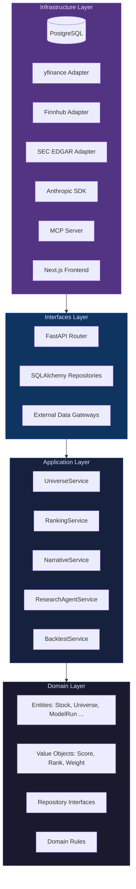
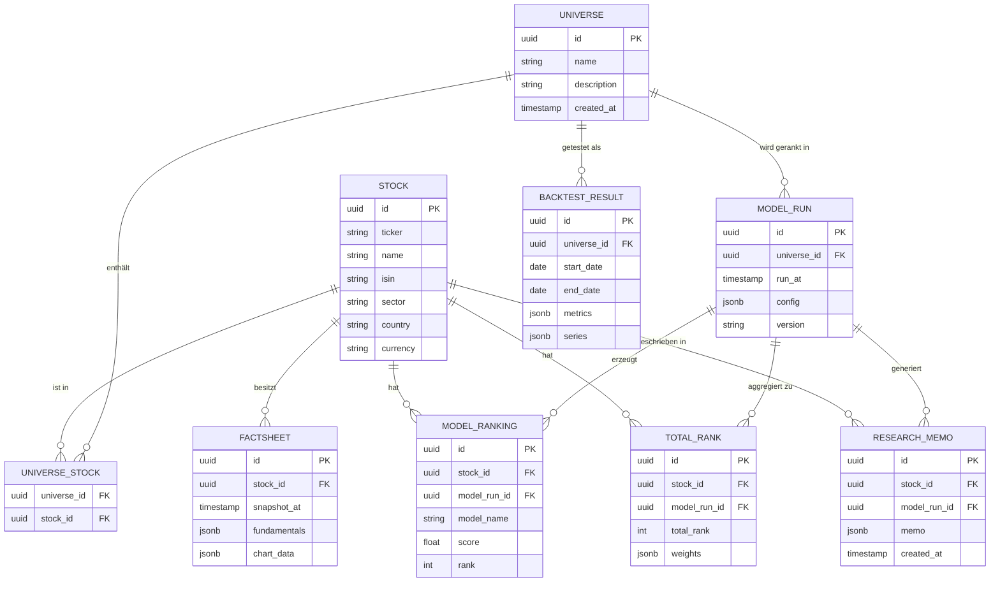

# PRISMA — Design-Spec & Capstone-Referenzdokument

**Status: Draft v1.1 — 2026-04-21**

Modul: AI-assisted Software Development | BSc Business Artificial Intelligence | FHNW FS 2026
Team: Sheyla, Fabia, Nicolas, Andrea

---

## Inhaltsverzeichnis

1. [Kontext & Ziele](#1-kontext--ziele)
2. [Produktvision: PRISMA](#2-produktvision-prisma)
3. [Bewertungsraster & Scope-Entscheidungen](#3-bewertungsraster--scope-entscheidungen)
4. [Architektur](#4-architektur)
5. [Domain-Modell & ER-Diagramm](#5-domain-modell--er-diagramm)
6. [Die 5 quantitativen Modelle](#6-die-5-quantitativen-modelle)
7. [Aggregation & Total Rank](#7-aggregation--total-rank)
8. [Die 3 AI-Layer](#8-die-3-ai-layer)
9. [Services & Use Cases](#9-services--use-cases)
10. [API-Spezifikation](#10-api-spezifikation)
11. [Frontend](#11-frontend)
12. [Tech-Stack](#12-tech-stack)
13. [Datenquellen](#13-datenquellen)
14. [Test-Strategie](#14-test-strategie)
15. [CI/CD & Deployment](#15-cicd--deployment)
16. [Team-Rollen & Verantwortlichkeiten](#16-team-rollen--verantwortlichkeiten)
17. [Zeitplan](#17-zeitplan)
18. [Risiken & Mitigations](#18-risiken--mitigations)
19. [Stretch-Goals (Post-MVP)](#19-stretch-goals-post-mvp)
20. [5.5-Sicherungs-Checkliste](#20-55-sicherungs-checkliste)
21. [Change Log](#21-change-log)

---

## 1. Kontext & Ziele

PRISMA ist das Capstone-Projekt im Modul "AI-assisted Software Development" des BSc Business Artificial Intelligence an der FHNW Hochschule für Wirtschaft (FS 2026). Das Capstone macht 100% der Modulnote aus.

Das Projekt ist angelehnt an eine reale Lösung der Vireos AG (Schweizer Asset-Manager) und wird von einem 4-Personen-Studententeam in ca. 12 Wochen neben dem Studium entwickelt.

**Ziel**: Note 5.5 durch solide, nachweisbare Exzellenz über alle Bewertungsachsen — keine Weltrevolution, aber saubere Ausführung auf jeder Ebene.

---

## 2. Produktvision: PRISMA

PRISMA ist ein quantitatives Stock-Selection-Tool. Wie ein optisches Prisma weisses Licht in seine Spektralfarben zerlegt, zerlegt PRISMA Unternehmen in analytische Dimensionen: Quality, Trend, Value und Risk.

### Nutzungsfluss (Happy Path)

1. Nutzer wählt ein Universum (SMI, S&P500-Subset oder eigene Ticker-Liste)
2. PRISMA lädt Markt- und Fundamentaldaten via yfinance / Finnhub
3. Fünf quantitative Modelle berechnen je Aktie einen Rang (1 = bestes Ergebnis)
4. Ränge werden zu einem **Total Rank** aggregiert
5. Output: farbcodierte Übersichtstabelle + Factsheets pro Unternehmen
6. Für Top-N: KI-generierte Research-Memos (Layer 1) und Multi-Agent-Deep-Dives (Layer 2)
7. Portfolio-Manager kann PRISMA via MCP aus Claude Desktop natürlichsprachlich befragen (Layer 3)

### Beispielabfrage via MCP

```
"Zeig mir SPI-Titel, die in Quality und Trend Top-20% sind, aber in Risk nur Mittelfeld."
```

---

## 3. Bewertungsraster & Scope-Entscheidungen

| Achse | Gewicht | Wie PRISMA diese Achse adressiert |
|---|---|---|
| AI-assisted Development & Tooling | 40% | AGENTS.md, Spec-Driven Development, AI-USAGE.md, 3 AI-Layer, MCP-Server |
| Testing & QS | 15% | Unit + Integration + E2E (Playwright), Coverage ≥80%, LLM-Fixture-Tests |
| CI/CD & Deployment | 15% | GitHub Actions (CI + Release + Deploy), Docker, Render + Postgres |
| Dokumentation & Präsentation | 15% | Diese Spec, README, ADRs, OpenAPI/Swagger, 15-Min-Präsi |
| Problem & Use Case | 5% | Realer Asset-Management-Kontext (Vireos AG), klar abgegrenzte Use Cases |
| Architektur & Design | 5% | Clean Architecture, 8 Entitäten, Dependency-Inversion, OpenAPI |
| Business-Logik & Domänenmodell | 5% | 5 Quant-Modelle, 5 Services, 8 Entitäten |

**Scope-Priorisierung**: Die 40%-Achse (AI-Tooling) ist der primäre Hebel. Jede Architektur- und Implementierungsentscheidung wird daraufhin geprüft, ob sie die nachweisbare AI-Nutzung stärkt.

---

## 4. Architektur

### 4.1 Clean Architecture

PRISMA folgt strikt der Clean Architecture nach Robert C. Martin. Die Dependency-Richtung zeigt ausschliesslich von aussen nach innen: Infrastructure → Interfaces → Application → Domain. Der Domain-Layer hat keine externen Abhängigkeiten.



### 4.2 Verzeichnisstruktur

```
prisma-capstone/
├── backend/
│   ├── domain/
│   │   ├── entities/          # Stock, Universe, ModelRun, ...
│   │   ├── value_objects/     # Score, Rank, CategoryWeight
│   │   └── repositories/      # Abstrakte Interfaces (ABC)
│   ├── application/
│   │   ├── services/          # UniverseService, RankingService, ...
│   │   └── use_cases/         # Einzelne Use-Case-Klassen
│   ├── interfaces/
│   │   ├── api/               # FastAPI Router + Schemas
│   │   └── persistence/       # SQLAlchemy-Implementierungen
│   ├── infrastructure/
│   │   ├── adapters/          # yfinance, Finnhub, EDGAR
│   │   ├── llm/               # Anthropic-Client, Prompt-Templates
│   │   └── mcp/               # MCP-Server-Implementierung
│   └── tests/
│       ├── unit/
│       ├── integration/
│       └── fixtures/          # Golden-Datasets, LLM-Recordings
├── frontend/                  # Next.js 14 App Router
├── docs/
│   ├── specs/                 # Diese Datei + weitere Specs
│   ├── adr/                   # Architecture Decision Records
│   └── AI-USAGE.md            # Reflexion AI-Nutzung
├── AGENTS.md                  # Coding-Agent-Protokoll
├── docker-compose.yml
└── .github/workflows/
```

### 4.3 Dependency Injection

Alle Repository-Interfaces werden per Constructor Injection in Services übergeben. FastAPI's `Depends()` verwaltet den Lifecycle. Kein globaler State ausserhalb des DI-Containers.

---

## 5. Domain-Modell & ER-Diagramm

### 5.1 Entitäten (8 Stück — erfüllt ≥5-Anforderung)

| Entität | Schlüsselfelder | Beschreibung |
|---|---|---|
| `Stock` | ticker, name, isin, sector, country, currency | Basiseinheit; ein reales Unternehmen |
| `Universe` | id, name, description | Benannte Aktien-Menge (SMI, Custom, etc.) |
| `ModelRun` | id, universe_id, timestamp, config_json, version | Versionierter Ausführungskontext aller Modelle |
| `ModelRanking` | id, stock_id, model_run_id, model_name, score, rank | Einzelergebnis eines Modells für eine Aktie |
| `TotalRank` | id, stock_id, model_run_id, total_rank, weights_json | Aggregierter Rang mit gespeicherten Gewichten |
| `Factsheet` | id, stock_id, timestamp, fundamentals_json, chart_json | Snapshot der Fundamentaldaten + Chart-Reihen |
| `ResearchMemo` | id, stock_id, model_run_id, memo_json, created_at | KI-generiertes strukturiertes Dossier |
| `BacktestResult` | id, universe_id, start_date, end_date, metrics_json, series_json | Historische Simulations-Metriken |

### 5.2 ER-Diagramm



---

## 6. Die 5 quantitativen Modelle

Alle Modelle liegen im Domain-Layer (pure Python, keine DB-Abhängigkeit). Jedes Modell implementiert das Interface `BaseModel.run(universe_data: UniverseData) -> list[ModelRankingResult]`.

### 6.1 Quality Classic (Kategorie: Quality)

Gleichgewichtete Kombination aus 8 Fundamentalkennzahlen:

| Kennzahl | Richtung | Quelle |
|---|---|---|
| P/E Ratio | Niedrig = besser | yfinance |
| P/B Ratio | Niedrig = besser | yfinance |
| FCF Yield | Hoch = besser | yfinance |
| Operating Margin | Hoch = besser | yfinance |
| Dividendenrendite | Hoch = besser | yfinance |
| Debt/Equity | Niedrig = besser | yfinance |
| EPS-Wachstum (3J) | Hoch = besser | yfinance |
| Sales-Wachstum (3J) | Hoch = besser | yfinance |

Vorgehen: Z-Score-Normalisierung je Kennzahl → gleiche Gewichtung → Quality-Score → Rang aufsteigend (1 = bester Score).

### 6.2 Trend Momentum (Kategorie: Trend)

EWMA der relativen Returns gegen ein equal-weighted Universum. Vollständige Spec mit Formeln in `docs/specs/2026-04-27-quant-models-redesign.md` §3.1.

- Benchmark = `prices.mean(axis=1)` (Equal-Weighted, nicht ^SSMI — dominiert von Nestlé/Roche)
- EWMA mit `halflife=63` Tagen (3 Monate); jüngere Tage höher gewichtet
- Score = letzter EWMA-Wert pro Ticker, höchster Score = Rang 1
- Kein Volatility-Adjustment, keine Sektor-Neutralisierung — bewusst einfach gehalten
- Fundament: Jegadeesh-Titman 1993, Carhart 1997 (Momentum-Persistenz 3–12 Monate)

### 6.3 Alpha (Kategorie: Trend)

Relative Performance einer Aktie gegen den Benchmark-Index über 5 Zeithorizonte:

| Horizont | Gewicht |
|---|---|
| 1 Woche | 10% |
| 3 Monate | 15% |
| 6 Monate | 25% |
| 1 Jahr | 30% |
| 2 Jahre | 20% |

Zusätzlich: Sharpe-Ratio der Outperformance-Reihe als Qualitätsmass. Gewichteter Alpha-Score → Rang.

### 6.4 Value Alpha Potential (Kategorie: Value)

Mean-Reversion gegen das eigene Outperformance-Hoch. Vollständige Spec in `docs/specs/2026-04-27-quant-models-redesign.md` §3.2.

- Schritt 1: rollendes 63-Tage-Alpha (Stock-Return − Benchmark-Return)
- Schritt 2: Rolling-Maximum dieser Alpha-Reihe über 252 Tage (1 Jahr)
- Schritt 3: `potential = rolling_max_alpha − current_alpha`
- Höchstes `potential` = Rang 1 (grösstes Snap-Back-Setup)
- Fundament: De Bondt-Thaler 1985, Lo-MacKinlay 1990 (Mean-Reversion)
- **Achtung**: kein Quality-Gate — kann Junk-Stocks ranken, die zu Recht gefallen sind. Master-Rank-Aggregation balanciert das durch Quality + Diversification.

### 6.5 Diversification (Kategorie: Risk)

Kovarianzmatrix des Universums mit Ledoit-Wolf-Shrinkage (scikit-learn `LedoitWolf`). Je Aktie wird berechnet:

- Annualisierte Volatilität (Eigenvolatilität)
- Durchschnittliche Korrelation zu allen anderen Titeln im Universum

Score = harmonisches Mittel aus (1/Volatilität) und (1/mittlere Korrelation). Rang aufsteigend (niedrigstes Risiko = Rang 1).

---

## 7. Aggregation & Total Rank

### 7.1 Standard-Aggregation

```
TotalRank = Ø(Quality-Classic-Rang, Alpha-Rang, Trend-Momentum-Rang, Value-Alpha-Potential-Rang, Diversification-Rang)
```

Aufsteigende Sortierung: Aktie mit kleinstem Durchschnitts-Rang = Total Rank 1.

### 7.2 Gewichtete Aggregation (konfigurierbar)

Nutzer kann Kategorie-Gewichte über API oder UI überschreiben:

```json
{
  "quality_classic": 0.20,
  "alpha": 0.20,
  "trend_momentum": 0.20,
  "value_alpha_potential": 0.20,
  "diversification": 0.20
}
```

Die Gewichte werden als `weights_json` im `TotalRank`-Record persistiert, um Reproduzierbarkeit zu garantieren.

### 7.3 Quant Sweet Spot

Heuristik: Aktie gilt als "Sweet Spot", wenn sie in mindestens 3 der 5 Modelle unter den Top-25% des Universums rangiert. Dieses Flag wird im `TotalRank`-Record gespeichert und im UI visuell hervorgehoben.

### 7.4 Backtest (Light)

`BacktestService` simuliert monatliches Rebalancing nach Total Rank (Top-N kaufen). Verglichene Portfolios:

| Portfolio | Beschreibung |
|---|---|
| PRISMA Top-N | Gleichgewichtet, monatlich rebalanciert nach Total Rank |
| Index | Benchmark-Rendite (yfinance) |
| Equal Weight | Alle Titel gleichgewichtet, kein Rebalancing |

Metriken: annualisierte Rendite, annualisierte Volatilität, Sharpe-Ratio, Maximum Drawdown.

---

## 8. Die 3 AI-Layer

### 8.1 Layer 1: Narrative Engine

**Zweck**: Für jede Aktie in den Top-N (konfigurierbar, Default: 20) wird ein strukturiertes Research-Memo via Claude API generiert.

**Pydantic-Output-Schema** (erzwingt JSON-strukturierten Output):

```python
class ResearchMemoSchema(BaseModel):
    ticker: str
    total_rank: int
    ranking_interpretation: str
    sweet_spot: bool
    sweet_spot_explanation: str | None
    contradictions: list[ContradictionItem]
    key_strengths: list[str]
    key_risks: list[str]
    one_liner: str
```

**Prompt-Caching**: System-Prompt mit Modell-Logik und Interpretationsregeln wird gecacht (Anthropic Prompt Caching). Nur der stock-spezifische Context-Block variiert pro Aufruf.

**Widerspruchs-Erkennung**: Zwei automatische Regeln:
- wenn Quality-Classic-Rang < 20% aber Diversification-Rang > 80% → "Top Quality, aber hohes Klumpenrisiko"
- wenn Trend-Momentum-Rang < 20% aber Value-Alpha-Potential-Rang < 20% → "Stock outperformt aktuell stark, ist aber gleichzeitig weit unter seinem Alpha-Peak"

### 8.2 Layer 2: Multi-Agent Deep-Dive

**Scope**: Die 10 Aktien mit bestem Total Rank erhalten ein erweitertes Dossier.

**Agent-Architektur** (LangGraph oder Anthropic SDK mit Tool-Use):

| Agent | Aufgabe | Datenquelle |
|---|---|---|
| Fundamentals-Agent | RAG über Geschäftsberichte | SEC EDGAR 10-K/10-Q PDFs, pgvector-Index |
| Sentiment-Agent | Aktuelle News analysieren | Finnhub Free Tier |
| Synthesizer-Agent | Konsolidiertes Dossier mit Quellenzitaten erstellen | Output der anderen Agenten |

**Ausgabeformat**: Pydantic-validiertes JSON. Quellenzitate als strukturierte Liste (Dokument + Seite bzw. News-URL + Datum).

**Parallelisierung**: Fundamentals- und Sentiment-Agent laufen parallel; Synthesizer startet erst nach beiden.

### 8.3 Layer 3: MCP-Server

PRISMA wird via Model Context Protocol (MCP) aus Claude Desktop nutzbar.

**Exponierte Tools**:

| Tool | Parameter | Beschreibung |
|---|---|---|
| `run_ranking` | `universe_id`, `weights?` | Startet neuen ModelRun, gibt Total Ranks zurück |
| `get_factsheet` | `ticker` | Gibt Factsheet-Snapshot einer Aktie zurück |
| `compare_stocks` | `tickers: list[str]`, `dimensions?` | Vergleich mehrerer Aktien über gewählte Modelle |
| `trigger_backtest` | `universe_id`, `start_date`, `end_date`, `top_n` | Startet Backtest-Simulation |

**Implementierung**: `mcp-sdk` (Python), läuft als separater Prozess neben dem FastAPI-Backend. Kommuniziert via HTTP mit dem Backend.

---

## 9. Services & Use Cases

Alle Services liegen im Application-Layer und kennen nur Domain-Interfaces, nie konkrete Implementierungen.

### 9.1 UniverseService

Verantwortlich für Universum-Verwaltung und Datensynchronisation.

| Use Case | Eingabe | Ausgabe |
|---|---|---|
| `create_universe` | Name, Ticker-Liste | Universe-Entity |
| `validate_tickers` | Liste von Ticker-Strings | Validierungsbericht |
| `sync_market_data` | Universe-ID, Datum | Anzahl synchronisierter Datensätze |
| `list_universes` | Pagination-Parameter | Paginierte Universe-Liste |

### 9.2 RankingService

Orchestriert die 5 Modelle und persistiert Ergebnisse.

| Use Case | Eingabe | Ausgabe |
|---|---|---|
| `run_full_ranking` | Universe-ID, Config | ModelRun-ID |
| `get_ranking_results` | ModelRun-ID | Liste TotalRank + ModelRankings |
| `compute_total_rank` | ModelRun-ID, Gewichte | Aggregierter Total Rank |

### 9.3 NarrativeService

Generiert Research-Memos via Claude API.

| Use Case | Eingabe | Ausgabe |
|---|---|---|
| `generate_memo` | Stock-ID, ModelRun-ID | ResearchMemo-Entity |
| `batch_generate_memos` | ModelRun-ID, Top-N | Liste ResearchMemo |
| `get_memo` | Stock-ID, ModelRun-ID | Existierendes ResearchMemo |

### 9.4 ResearchAgentService

Multi-Agent-Pipeline für tiefere Analyse.

| Use Case | Eingabe | Ausgabe |
|---|---|---|
| `trigger_deep_dive` | Stock-ID, ModelRun-ID | Job-ID (async) |
| `get_deep_dive_status` | Job-ID | Status + partielles Ergebnis |
| `get_deep_dive_result` | Job-ID | Vollständiges Agenten-Dossier |

### 9.5 BacktestService

Historische Simulation und Metrik-Berechnung.

| Use Case | Eingabe | Ausgabe |
|---|---|---|
| `run_backtest` | Universe-ID, Start/End, Top-N | BacktestResult-Entity |
| `get_backtest_result` | BacktestResult-ID | Metriken + Zeitreihen |

---

## 10. API-Spezifikation

### 10.1 Endpunkte-Übersicht

Alle Endpunkte unter Prefix `/api/v1`. OpenAPI/Swagger-UI unter `/docs` (öffentlich erreichbar).

| Method | Pfad | Service | Beschreibung |
|---|---|---|---|
| GET | `/universes` | UniverseService | Alle Universen auflisten |
| POST | `/universes` | UniverseService | Neues Universum erstellen |
| GET | `/universes/{id}` | UniverseService | Universum-Details |
| POST | `/universes/{id}/sync` | UniverseService | Marktdaten synchronisieren |
| POST | `/rankings/run` | RankingService | Neuen Ranking-Lauf starten |
| GET | `/rankings/{run_id}` | RankingService | Ranking-Ergebnis abrufen |
| GET | `/rankings/{run_id}/total` | RankingService | Total Rank für Lauf |
| GET | `/stocks/{ticker}/factsheet` | — | Factsheet abrufen |
| POST | `/memos/generate` | NarrativeService | Memo generieren (sync) |
| POST | `/memos/batch` | NarrativeService | Batch-Memo-Generierung |
| GET | `/memos/{stock_id}/{run_id}` | NarrativeService | Memo abrufen |
| POST | `/deep-dive/{stock_id}` | ResearchAgentService | Deep-Dive starten (async) |
| GET | `/deep-dive/status/{job_id}` | ResearchAgentService | Job-Status |
| POST | `/backtests/run` | BacktestService | Backtest starten |
| GET | `/backtests/{id}` | BacktestService | Backtest-Ergebnis |

### 10.2 Authentifizierung

MVP: API-Key-Header (`X-API-Key`). Key wird als Umgebungsvariable konfiguriert. MCP-Server trägt den Key automatisch.

### 10.3 Fehlerformat

```json
{
  "error": {
    "code": "UNIVERSE_NOT_FOUND",
    "message": "Universe with ID abc123 does not exist.",
    "request_id": "req_xyz"
  }
}
```

---

## 11. Frontend

### 11.1 Seitenstruktur (Next.js App Router)

| Route | Komponente | Funktion |
|---|---|---|
| `/` | Dashboard | Aktive Universen, letzter Ranking-Lauf |
| `/universes` | UniverseList | Universen verwalten |
| `/universes/new` | UniverseForm | Ticker-Liste eingeben, validieren |
| `/rankings/[runId]` | RankingTable | Farbcodierte Übersichtstabelle |
| `/rankings/[runId]/stock/[ticker]` | Factsheet | Kennzahlen + Charts + Memo |
| `/backtests` | BacktestList | Vergangene Backtests |
| `/backtests/[id]` | BacktestChart | Performance-Kurven, Metriken |

### 11.2 Ranking-Tabelle

- Farbkodierung: Rang-Quartile (Q1 = grün, Q4 = rot) via `shadcn/ui` Badge-Komponenten
- Sortierung nach jeder Spalte (Total Rank und alle 5 Einzel-Modelle)
- Sweet-Spot-Flag visuell (Stern-Icon)
- Klick auf Zeile → Factsheet

### 11.3 Factsheet

- Fundamentaldaten-Karte mit aktuellen Kennzahlen
- Preis-Chart (Recharts) mit Benchmark-Overlay
- Research-Memo (aus Layer 1) als strukturiertes Textpanel
- Button "Deep Dive anfordern" (triggert Layer 2, Polling für Status)

---

## 12. Tech-Stack

| Schicht | Technologie | Version | Begründung |
|---|---|---|---|
| Backend | Python | 3.12 | Stabile LTS-Version |
| Web-Framework | FastAPI | 0.111+ | Async, OpenAPI nativ, Pydantic-Integration |
| Datenvalidierung | Pydantic | v2 | Performance, JSON-Schema, LLM-Output-Validierung |
| ORM | SQLAlchemy | 2.0 | Async-Support, Clean-Arch-kompatibel |
| Migrationen | Alembic | 1.13+ | Versionierte DB-Migrationen |
| Quant | pandas, numpy | aktuell | Standardbibliotheken |
| ML | scikit-learn | 1.5+ | Lasso, LedoitWolf |
| Marktdaten | yfinance | aktuell | Gratis, ausreichend |
| News | Finnhub Python Client | aktuell | Free Tier |
| LLM | Anthropic SDK | aktuell | Claude API, Prompt Caching |
| Agent-Framework | Anthropic SDK (Tool-Use) | aktuell | Direkter Kontrolle, kein Overhead |
| MCP | mcp-sdk (Python) | aktuell | Offizielle Implementation |
| Datenbank | PostgreSQL | 16 | Managed auf Render |
| Vector-Store | pgvector | aktuell | RAG ohne separate Infrastruktur |
| Frontend | Next.js | 14 (App Router) | SSR, gute DX |
| UI-Komponenten | shadcn/ui | aktuell | Konsistenz, Zugänglichkeit |
| Charts | Recharts | 2.x | React-nativ |
| Testing Backend | pytest, pytest-asyncio, pytest-cov | aktuell | Standard-Ökosystem |
| Testing E2E | Playwright | aktuell | Cross-Browser |
| CI | GitHub Actions | — | Kostenlos für öffentliche Repos |
| Container | Docker + docker-compose | aktuell | Lokale Entwicklung |
| Deploy | Render | — | Einfach, Postgres managed |
| Registry | GitHub Container Registry (GHCR) | — | Kostenlos |
| Linting Python | ruff, mypy | aktuell | Schnell, typ-sicher |
| Linting Frontend | eslint, prettier | aktuell | Standard |

---

## 13. Datenquellen

| Quelle | Nutzung | Limit / Hinweis |
|---|---|---|
| yfinance | Tagespreise (Models 2–5), Fundamentaldaten-Snapshot (Model 1 primär) | Kein offizielles Limit; Caching Pflicht; CH-Tickers (.SW) bei Fundamentals lückenhaft |
| FinancialModelingPrep Free | Fundamentaldaten-Snapshot für Quality Classic, CH-Ticker-Lücken-Fallback | **250 Calls/Tag**; **kein Historical** verfügbar — daher Quality AI / Anti-Cyclical nicht implementierbar (siehe ADR 0005). Env-Variable: `FMP_API_KEY` |
| Finnhub Free Tier | News, Earnings-Dates für Layer-2 Sentiment-Agent | 60 Calls/min; Rate-Limit-Handling nötig |
| SEC EDGAR | 10-K / 10-Q PDFs für RAG | Öffentlich, kein Rate-Limit bei moderatem Zugriff |
| Synthetische Daten | Unit-Tests, Golden-Datasets | Reproduzierbar, kein Netzwerkzugriff |

> **Phase-2-MVP-Demo (ADR-0005):** Die 8 Quality-Classic-Fundamentalkennzahlen (P/E, P/B, FCF Yield, Operating Margin, Dividendenrendite, D/E, EPS-Wachstum 3J, Sales-Wachstum 3J) werden nicht zur Laufzeit per yfinance-API abgerufen, sondern aus einem committed CSV-Snapshot (`backend/data/fundamentals_demo_2026Q1.csv`) in Postgres geladen. Ein `YFinanceAdapter` hinter einem `FundamentalsPort` existiert im Codebase, wird jedoch ausschliesslich durch `scripts/refresh_fundamentals.py` (manueller Pre-Presentation-Refresh) aufgerufen — nie durch Application-Services. Die obige Tabelle beschreibt den mittelfristigen Zielzustand.

**Caching-Strategie**: Alle externen Datenabrufe werden mit Timestamp in der `Factsheet`-Tabelle gecacht. TTL: 24 Stunden für Fundamentaldaten, 4 Stunden für Preisdaten. Adapter werfen `DataNotAvailableError` bei Fehler; Services entscheiden über Fallback.

---

## 14. Test-Strategie

### 14.1 Unit Tests

- Jedes der 5 Quant-Modelle erhält ein deterministisches Golden-Dataset (CSV-Fixture) mit vorberechnetem erwartetem Ranking
- Pydantic-Schema-Tests für alle LLM-Output-Schemas: synthetischer Input → Validierung muss grün sein
- Value-Object-Tests: Score-Normalisierung, Rang-Berechnung, Gewichtungslogik
- Service-Tests mit gemockten Repositories

### 14.2 Integration Tests

- FastAPI-Endpunkte gegen Test-Datenbank (PostgreSQL in Docker via pytest-fixture)
- Alembic-Migrations: sauberer Aufbau und Abbau
- Externe Adapter mit `responses`-Library gemockt (kein echtes Netzwerk)
- LLM-Layer im Fixture-Mode: aufgenommene Anthropic-Responses als JSON-Files

### 14.3 E2E Tests (Playwright)

Kritische User Journeys:

1. Universum erstellen mit 5 Ticker-Symbolen
2. Ranking-Lauf starten → Tabelle erscheint mit 5 Zeilen
3. Auf Aktie klicken → Factsheet öffnet mit Kennzahlen
4. "Memo anfordern" → Research-Memo erscheint
5. Backtest starten → Chart mit 3 Kurven wird angezeigt

### 14.4 LLM-Tests

| Test-Typ | Umgebung | Frequenz |
|---|---|---|
| Fixture-Tests | CI (kein echtes LLM) | Jeder Push |
| Golden-Prompt-Smoke-Tests | Echte Anthropic API | Wöchentlich via Cron-Workflow |
| Schema-Validierung | CI | Jeder Push |

### 14.5 Coverage-Ziel

≥80% Zeilenabdeckung (gemessen mit pytest-cov). Coverage-Report wird als CI-Artefakt publiziert und in PR-Kommentar gepostet.

---

## 15. CI/CD & Deployment

### 15.1 GitHub Actions Workflows

**`ci.yml`** — Trigger: push + pull_request auf `main` und `develop`

```
1. Lint: ruff check, mypy, eslint
2. Unit Tests: pytest tests/unit/
3. Integration Tests: pytest tests/integration/ (PostgreSQL Service-Container)
4. Coverage Report: pytest-cov → Kommentar auf PR
5. Frontend Build: next build
```

**`e2e.yml`** — Trigger: merge auf `main`

```
1. Docker-Compose Stack hochfahren
2. Playwright Tests ausführen
3. Artefakte (Screenshots, Videos) bei Fehler hochladen
```

**`release.yml`** — Trigger: Tag `v*`

```
1. Semantic Versioning validieren
2. CHANGELOG.md generieren
3. Docker-Image bauen und auf GHCR pushen
4. GitHub Release erstellen
```

**`deploy.yml`** — Trigger: push auf `main` (nach ci.yml)

```
1. Render Deploy Hook triggern (Backend + Frontend)
2. Smoke-Test gegen Production-URL
```

### 15.2 Deployment-Infrastruktur

| Komponente | Service | Plan |
|---|---|---|
| Backend (FastAPI) | Render Web Service | Free Tier (Fallback: Starter $7/Mo) |
| Frontend (Next.js) | Render Static Site | Free |
| Datenbank | Render Managed PostgreSQL | Free Tier (1 GB) |
| pgvector | Als PostgreSQL-Extension | Inklusive |

### 15.3 Umgebungsvariablen (Pflicht in Render)

```
DATABASE_URL          # Render Postgres Connection String
ANTHROPIC_API_KEY     # Claude API
FMP_API_KEY           # FinancialModelingPrep Free Tier (250 calls/day)
FINNHUB_API_KEY       # Finnhub Free Tier (Layer-2 Sentiment-Agent)
API_KEY               # Interner API-Key für MCP-Server
ENVIRONMENT           # "production" | "staging"
```

### 15.4 Docker-Compose (lokal)

```yaml
services:
  backend:   # FastAPI mit Hot-Reload
  frontend:  # Next.js Dev-Server
  db:        # PostgreSQL 16 mit pgvector
  mcp:       # MCP-Server
```

---

## 16. Team-Rollen & Verantwortlichkeiten

| Rolle | Person | Primärer Scope |
|---|---|---|
| A — Quant Core | TBD | 5 Quant-Modelle, Daten-Adapter (yfinance/Finnhub/EDGAR), Golden-Datasets, BacktestService |
| B — AI Engineer | TBD | NarrativeService, Multi-Agent-Pipeline (Layer 2), MCP-Server (Layer 3), Prompt-Caching |
| C — Platform | TBD | Clean-Arch-Skelett, FastAPI, Alembic-Migrationen, Docker, GitHub Actions, Render-Deploy |
| D — Frontend & Demo | TBD | Next.js-App, shadcn/ui-Komponenten, Playwright-E2E-Tests, README, ADRs, Präsentation |

**Querschnittsaufgaben (alle 4 Personen)**:

- Spec-Driven Development: jede Feature-Arbeit beginnt mit einer kurzen Spec oder einem ADR
- AGENTS.md: wöchentliche Aktualisierung mit konkreten Coding-Agent-Dialogen
- AI-USAGE.md: individuelle Reflexionseinträge pro Sprint
- PR-Reviews: jedes PR braucht mindestens 1 Approval

**Kommunikation**: Trunk-Based Development auf `main`, Feature-Branches mit maximal 3 Tagen Laufzeit. Wöchentliches Sync-Meeting, Fortschritt via GitHub Project Board.

---

## 17. Zeitplan

| Woche | Meilenstein | Definition of Done |
|---|---|---|
| 1–2 | Fundament | 1 End-to-End-Vertikale live (Quality Classic → API → DB → UI) auf Render; Docker-Compose lokal stabil; AGENTS.md initialisiert |
| 3–5 | Quant Core | Alle 5 Modelle mit Golden-Dataset unit-getestet und grün; RankingService aggregiert korrekt; BacktestService (Grundgerüst) |
| 5–7 | AI-Layer 1 | NarrativeService produktiv; Pydantic-Schema-Tests grün; Prompt-Caching aktiv; Fixture-Mode in CI |
| 7–9 | AI-Layer 2+3 | Multi-Agent-Pipeline für Top-10 lauffähig; MCP-Server via Claude Desktop testbar; pgvector-Index für Geschäftsberichte |
| 9–10 | Backtest + UI-Polish | Backtest läuft mit Metriken und Chart; Frontend vollständig (alle Routen, Farbkodierung, Sweet-Spot-Flag) |
| 11 | Härten | Coverage ≥80% in CI sichtbar; alle E2E-Tests grün; README-Setup durch externen Tester in <10 Minuten verifiziert; ADRs vollständig |
| 12 | Präsentation | Dry-Run durchgeführt; 15-Min-Skript fertig; Production-URL stabil; Demo-Datensatz vorbereitet |

**Kritischer Pfad**: Fundament (Wo 1–2) → Quant Core (Wo 3–5) → AI-Layer 1 (Wo 5–7). Verzögerungen hier verschieben alle nachgelagerten Layer.

---

## 18. Risiken & Mitigations

| Risiko | Wahrscheinlichkeit | Impact | Mitigation |
|---|---|---|---|
| Scope-Explosion Quant-Modelle | Mittel | Hoch | Hartes MVP-Commitment auf 5 Modelle; weitere nur als Stretch dokumentiert |
| EWMA halflife=63 / Rolling-Max-Window=252 sind Hyperparameter — Performance auf SMI evtl. enttäuschend | Mittel | Mittel | Im Backtest mit alternativen Werten (halflife=21/126, window=126/365) vergleichen; Default dokumentiert in Spec 2026-04-27 §3 |
| LLM-Output nicht deterministisch / nicht testbar | Mittel | Mittel | Fixture-Mode für CI; Pydantic-Validierung; weekly Smoke-Tests gegen echte API |
| Render Free Tier zu langsam für Demo | Mittel | Mittel | Fallback auf Starter Plan (ca. $7/Monat, teilbar im Team) |
| yfinance Rate-Limits / Daten-Lücken | Hoch | Mittel | Aggressives Caching in PostgreSQL; Retry mit Exponential Backoff; FinancialModelingPrep als Backup |
| Finnhub Free-Tier-Limit erschöpft | Mittel | Niedrig | Caching; Sentiment-Agent läuft nur für Top-10, nicht für das ganze Universum |
| Team-Merge-Konflikte bei Clean-Arch-Boundaries | Mittel | Mittel | Klar getrennte Layer-Ownership; Interface-First-Development; tägliche Syncs in heissen Phasen |
| pgvector / RAG-Index aufwendiger als geplant | Mittel | Mittel | 10-K-Ingest als Late-Feature: erst Wo 7; Minimum: 3 PDFs für Demo ausreichend |
| Anthropic API-Kosten überschreiten Budget | Niedrig | Mittel | Prompt-Caching reduziert Kosten ~90% für System-Prompt; Batch-Memos nur auf Anfrage, nicht automatisch |

---

## 19. Stretch-Goals (Post-MVP)

Diese Features sind explizit **nicht im MVP-Scope** und werden erst nach Woche 10 angegangen, wenn alle Kernanforderungen erfüllt sind.

| Feature | Kategorie | Begründung für Deferral |
|---|---|---|
| Statistical Arbitrage (PCA + Ornstein-Uhlenbeck) | Quant | Hohe mathematische Komplexität; braucht sauberes Pairs-Trading-Framework |
| Earnings Cycle (Hampel-Filter) | Quant | Datenqualität der Earnings-Reihen variabel |
| Quality AI (Lasso) | Quant | Braucht point-in-time Fundamentals — FMP Free liefert keine, FMP Starter ohne Restatement-Flag = Look-Ahead-Bias. Bezahl-Quelle (Bloomberg/SIX) ausserhalb Capstone-Budget. Siehe ADR 0005. |
| Anti-Cyclical (3J-Median P/E) | Quant | Braucht historische P/E-Reihen; FMP Free liefert keine. Siehe ADR 0005. |
| Multi-Horizon Momentum (gewichteter Mix halflife 21/63/126) | Quant | Erweiterung von Trend Momentum, nicht im MVP-Scope |
| Sektor-neutrales Trend Momentum | Quant | Spannend für Demo, aber Kategorie-Mapping pro Ticker erhöht Komplexität |
| Walk-Forward-Analyse | Backtest | Komplexität vs. Nutzen für Demo |
| Transaktionskosten-Modell | Backtest | Scope-Erweiterung ohne direkten Bewertungsnutzen |
| Multi-Faktor-Risiko-Modell | Quant | Barra-ähnlich; eigenes Projekt |
| Lokalisierung / Multi-Währungs-Normalisierung | Platform | Relevant für Production, übertrieben für Capstone |

---

## 20. 5.5-Sicherungs-Checkliste

Zu prüfen am Ende von Woche 10 — alle Punkte müssen abgehakt sein für Zielnote 5.5.

**AI-Tooling (40%-Achse)**
- [ ] Mindestens 10 PRs mit nachweisbarem Spec-Driven-Commit-Pattern (Commit-Nachricht referenziert Spec oder ADR)
- [ ] AGENTS.md enthält konkrete Coding-Agent-Dialoge aus mindestens 5 verschiedenen Features
- [ ] docs/AI-USAGE.md enthält individuelle Reflexionseinträge aller 4 Teammitglieder
- [ ] Alle 3 AI-Layer sind live demonstrierbar (Memo-Generierung, Deep-Dive, MCP-Tool-Aufruf aus Claude Desktop)

**Testing (15%-Achse)**
- [ ] pytest-cov-Report zeigt ≥80% Zeilenabdeckung, sichtbar als CI-Artefakt
- [ ] Golden-Dataset-Tests für alle 5 Quant-Modelle grün
- [ ] Alle 5 Playwright-E2E-Szenarien bestehen
- [ ] LLM-Fixture-Tests laufen in CI ohne echte API-Calls

**CI/CD & Deployment (15%-Achse)**
- [ ] Production-URL auf Render erreichbar (kein "Sleeping"-Zustand während Demo)
- [ ] Swagger-UI unter `/docs` öffentlich zugänglich
- [ ] Docker-Image auf GHCR published (mindestens 1 Release-Tag)
- [ ] GitHub Actions: ci.yml + e2e.yml + release.yml alle grün im letzten Run

**Dokumentation (15%-Achse)**
- [ ] README-Setup durch externe Person (kein Teammitglied) in unter 10 Minuten verifiziert
- [ ] Mindestens 3 ADRs in docs/adr/ mit vollständigem Status-Feld
- [ ] 15-Minuten-Präsentation strukturiert um die 4 Hauptachsen des Bewertungsrasters
- [ ] OpenAPI-Spec vollständig (alle Endpunkte mit Beschreibung, Request/Response-Schema)

---

## 21. Change Log

| Version | Datum | Autor | Änderung |
|---|---|---|---|
| Draft v1.0 | 2026-04-21 | Documentation Engineer | Initiales Dokument erstellt; alle Sektionen vollständig ausgearbeitet |
| Draft v1.1 | 2026-04-21 | Sheyla / Claude Code | Tippfehler-Review: "Nota" → "Note", "grünsein" → "grün sein", "nebenberuflich" → "neben dem Studium", fehlender Artikel in Risiko-Mitigation. `UniverseStock` aus Entitäten-Tabelle entfernt (Bridge-Entity, bleibt im ER-Diagramm). |
| Draft v1.2 | 2026-04-27 | Fabia / Claude Code | Quant-Modelle-Redesign (PR #26, ADR 0005, Spec 2026-04-27): Quality AI + Anti-Cyclical raus (PIT-Daten / Historicals nicht im Free-Tier verfügbar), Trend Momentum + Value Alpha Potential rein. §6.2/§6.4 ersetzt, §7.1/§7.2 Default-Weights gleichgewichtet 0.20, §8.1 zweite Widerspruchs-Regel, §13 Datenquellen + FMP-Key, §15.3 env-Liste, §18 Risiko-Tabelle, §19 Stretch-Goals erweitert. |
