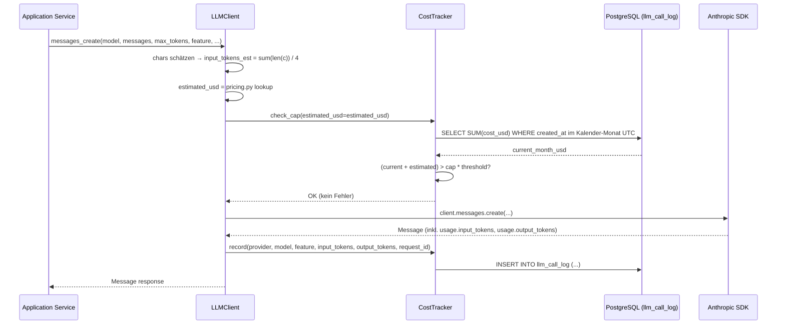
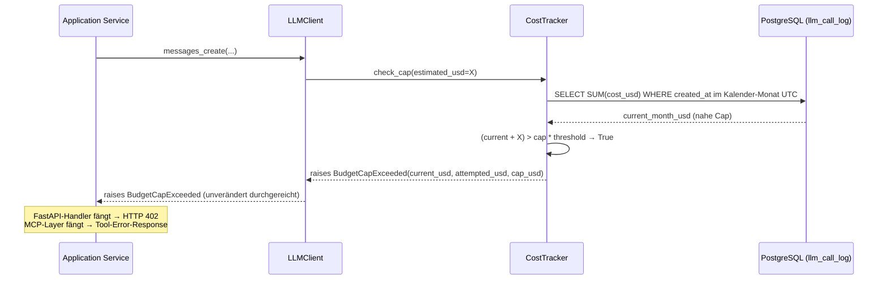

# Spec: Budget-Cap & Cost-Tracking (Issue #19)

- **Status**: Draft v1.0
- **Datum**: 2026-04-25
- **Kontext**: Implementiert Issue #19, setzt ADR-0004 §7 (Hard-Cap-Budget-Kontrolle) operationell um
- **Supersedes**: —
- **Rolle**: B — AI Engineer (Sheyla)
- **Parent-Spec**: `docs/specs/2026-04-21-prisma-v2-design.md` §10, §14

---

## Inhaltsverzeichnis

1. [Goals & Non-Goals](#1-goals--non-goals)
2. [Architektur-Überblick](#2-architektur-überblick)
3. [Datenmodell](#3-datenmodell)
4. [`LLMClient`-API](#4-llmclient-api)
5. [`CostTracker`-API](#5-costtracker-api)
6. [Pricing-Konstanten](#6-pricing-konstanten)
7. [Cap-Check-Algorithmus](#7-cap-check-algorithmus)
8. [Error-Handling](#8-error-handling)
9. [Admin-Endpoint](#9-admin-endpoint)
10. [Test-Strategie](#10-test-strategie)
11. [Build-Order](#11-build-order)
12. [Konfiguration](#12-konfiguration)
13. [Referenzen](#13-referenzen)

---

## 1. Goals & Non-Goals

### Goals

- **Hard-Cap** auf monatliche LLM-Gesamtkosten: vor jedem API-Call wird geprüft, ob das Monatsbudget (inkl. Schätzung) überschritten würde — wenn ja, Abbruch mit erklärendem Fehler
- **Audit-Log** jedes LLM-Calls in `llm_call_log`: Provider, Modell, Feature-Tag, Token-Counts, Kosten in USD
- **Admin-Sicht** auf aktuelle Monatskosten via `GET /api/v1/admin/costs` (aufgeschlüsselt nach Modell und Feature)
- **Multi-Provider**: sowohl Anthropic-Calls (Narrative Engine, Deep-Dive Synthesizer) als auch Voyage-Embeddings (RAG) werden erfasst

### Non-Goals

- Per-User-Cap (PRISMA hat keinen Endkunden-Login im MVP)
- Cost-Forecasting / Trend-Analyse
- Auto-Cap-Increase
- Frontend-UI für ein Cost-Dashboard
- Multi-Currency (alles in USD, synchronisiert mit Anthropic Console)
- Pro-Aktie-Kostengranularität — das `feature`-Tag ist die feinste Granularität (vgl. ADR-0004 §7)

---

## 2. Architektur-Überblick

`LLMClient` sitzt in der **Infrastructure-Schicht** (`backend/infrastructure/llm/client.py`). Es ist der einzige Einstiegspunkt zum Anthropic-SDK und zum Voyage-SDK im gesamten Stack. Application-Services (Narrative Engine, Deep-Dive Synthesizer, RAG-Ingestion) injizieren `LLMClient` via Dependency-Injection — sie importieren nie das Raw-SDK direkt (AGENTS.md-Regel: keine Direktzugriffe aus `application/` auf externe APIs).

`CostTracker` ist ein Application-Service (`backend/application/services/cost_tracker.py`). Er kapselt die Budget-Logik und den Datenbankzugriff — `LLMClient` ruft ihn auf, nicht umgekehrt.

### Happy-Path-Flow



### BudgetCapExceeded-Pfad



---

## 3. Datenmodell

### `llm_call_log`-Tabelle

```sql
CREATE TABLE llm_call_log (
    id            UUID PRIMARY KEY,
    created_at    TIMESTAMPTZ NOT NULL DEFAULT now(),
    provider      TEXT NOT NULL,           -- 'anthropic' | 'voyage'
    model         TEXT NOT NULL,
    feature       TEXT NOT NULL,           -- z.B. 'narrative_engine', 'deep_dive_synthesizer', 'rag_ingestion'
    input_tokens  INTEGER NOT NULL,
    output_tokens INTEGER NOT NULL,
    cost_usd      NUMERIC(10,6) NOT NULL,  -- Decimal, niemals Float (CLAUDE.md-Regel)
    request_id    TEXT
);

CREATE INDEX llm_call_log_created_at_idx ON llm_call_log (created_at);
```

`cost_usd` ist `NUMERIC(10,6)` (kein `FLOAT`), weil Geldbeträge Decimal verlangen — CLAUDE.md-Regel. Der Index auf `created_at` ist für die Cap-Check-Query kritisch: die monatliche `SUM`-Query filtert ausschliesslich über `created_at`.

### Alembic-Migration

Dateiname-Konvention: `<timestamp>_create_llm_call_log.py` (z.B. `20260425_create_llm_call_log.py`).

```python
# Skizze der relevanten Alembic-Ops
def upgrade() -> None:
    op.create_table(
        "llm_call_log",
        sa.Column("id", postgresql.UUID(as_uuid=True), primary_key=True),
        sa.Column("created_at", sa.TIMESTAMP(timezone=True), nullable=False,
                  server_default=sa.text("now()")),
        sa.Column("provider", sa.Text(), nullable=False),
        sa.Column("model", sa.Text(), nullable=False),
        sa.Column("feature", sa.Text(), nullable=False),
        sa.Column("input_tokens", sa.Integer(), nullable=False),
        sa.Column("output_tokens", sa.Integer(), nullable=False),
        sa.Column("cost_usd", sa.Numeric(precision=10, scale=6), nullable=False),
        sa.Column("request_id", sa.Text(), nullable=True),
    )
    op.create_index("llm_call_log_created_at_idx", "llm_call_log", ["created_at"])


def downgrade() -> None:
    op.drop_index("llm_call_log_created_at_idx", table_name="llm_call_log")
    op.drop_table("llm_call_log")
```

### SQLAlchemy-Model

Datei: `backend/infrastructure/persistence/models/llm_call_log.py`

```python
import uuid
from datetime import datetime
from decimal import Decimal

from sqlalchemy import Index, Integer, Numeric, Text
from sqlalchemy.dialects.postgresql import TIMESTAMP, UUID
from sqlalchemy.orm import Mapped, mapped_column

from infrastructure.persistence.base import Base


class LLMCallLog(Base):
    __tablename__ = "llm_call_log"

    id: Mapped[uuid.UUID] = mapped_column(UUID(as_uuid=True), primary_key=True,
                                           default=uuid.uuid4)
    created_at: Mapped[datetime] = mapped_column(TIMESTAMP(timezone=True), nullable=False)
    provider: Mapped[str] = mapped_column(Text, nullable=False)
    model: Mapped[str] = mapped_column(Text, nullable=False)
    feature: Mapped[str] = mapped_column(Text, nullable=False)
    input_tokens: Mapped[int] = mapped_column(Integer, nullable=False)
    output_tokens: Mapped[int] = mapped_column(Integer, nullable=False)
    cost_usd: Mapped[Decimal] = mapped_column(Numeric(10, 6), nullable=False)
    request_id: Mapped[str | None] = mapped_column(Text, nullable=True)

    __table_args__ = (
        Index("llm_call_log_created_at_idx", "created_at"),
    )
```

---

## 4. `LLMClient`-API

Datei: `backend/infrastructure/llm/client.py`

Der Wrapper hält intern zwei SDK-Instanzen (Composition, keine Vererbung): eine `anthropic.AsyncAnthropic`-Instanz und eine `voyage.AsyncClient`-Instanz. Aufrufer erhalten nur `LLMClient` — kein direkter SDK-Import ausserhalb von `infrastructure/llm/`.

```python
from typing import Any
from decimal import Decimal

from application.services.cost_tracker import CostTracker


class LLMClient:
    def __init__(self, cost_tracker: CostTracker) -> None:
        # Anthropic- und Voyage-SDK-Instanzen werden hier intern erstellt.
        # cost_tracker wird injiziert (kein direkter DB-Zugriff im LLMClient).
        ...

    async def messages_create(
        self,
        *,
        model: str,
        messages: list[dict[str, Any]],
        max_tokens: int,
        feature: str,
        system: str | None = None,
        **kwargs: Any,
    ) -> Any:  # Anthropic Message response
        """Wrapped anthropic.messages.create mit Pre-Call-Cap-Check und Post-Call-Logging.

        `feature` ist Pflicht-Parameter ohne Default. Aufrufer MUSS taggen —
        sonst ist das Audit-Log für den Admin-Endpoint unbrauchbar.
        """
        ...

    async def embed(
        self,
        *,
        model: str,
        texts: list[str],
        feature: str,
    ) -> list[list[float]]:
        """Wrapped voyage.embed mit Pre-Call-Cap-Check und Post-Call-Logging.

        `feature` ist Pflicht-Parameter ohne Default (gleiche Begründung wie messages_create).
        """
        ...
```

Interner Ablauf beider Methoden:
1. Kosten schätzen (chars/4 + `max_tokens` bzw. `sum(len(t)) / 4` für Embeddings)
2. `self._cost_tracker.check_cap(estimated_usd=...)` aufrufen — kann `BudgetCapExceeded` werfen
3. SDK-Call ausführen
4. `self._cost_tracker.record(...)` mit echten Token-Counts aus `response.usage`

---

## 5. `CostTracker`-API

Datei: `backend/application/services/cost_tracker.py`

`CostTracker` ist ein Application-Service: er darf auf Ports/Repositories zugreifen, aber er importiert keine Infrastruktur-Klassen direkt — nur abstrakte Interfaces.

```python
from decimal import Decimal

from domain.errors import BudgetCapExceeded


class CostTracker:
    async def check_cap(self, *, estimated_usd: Decimal) -> None:
        """Raises BudgetCapExceeded wenn (current_month_usage + estimated) > threshold * cap.

        Threshold default = 0.95, konfigurierbar via BUDGET_CAP_THRESHOLD (backend/config.py).
        """
        ...

    async def record(
        self,
        *,
        provider: str,
        model: str,
        feature: str,
        input_tokens: int,
        output_tokens: int,
        request_id: str | None = None,
    ) -> None:
        """Berechnet cost_usd via pricing.py und schreibt eine Zeile in llm_call_log."""
        ...
```

### Concurrency-Hinweis

Zwischen `check_cap` und `record` existiert ein kleines Race-Window: zwei parallele Calls können beide `check_cap` passieren, dann aber zusammen die Cap überschreiten. Bei Projektvolumen (max ~30 Calls/Batch) ist der maximale Slip einstellig. Der 5%-Puffer der 95%-Schwelle absorbiert das. Als Backstop dient das Anthropic Console Spend-Limit — das ist die letzte Sicherheitslinie und liegt auf Infrastruktur-Ebene, ausserhalb des eigenen Codes.

---

## 6. Pricing-Konstanten

Datei: `backend/infrastructure/llm/pricing.py`

```python
from dataclasses import dataclass
from decimal import Decimal


@dataclass(frozen=True)
class ModelPricing:
    input_per_mtok: Decimal    # USD pro 1 Million Input-Tokens
    output_per_mtok: Decimal   # USD pro 1 Million Output-Tokens
    embed_per_mtok: Decimal | None = None  # None für Non-Embedding-Modelle


PRICING: dict[str, ModelPricing] = {
    "claude-sonnet-4-6": ModelPricing(
        input_per_mtok=Decimal("..."),   # aus offizieller Anthropic Pricing-Page
        output_per_mtok=Decimal("..."),
    ),
    "claude-haiku-4-5": ModelPricing(
        input_per_mtok=Decimal("..."),
        output_per_mtok=Decimal("..."),
    ),
    "voyage-3-large": ModelPricing(
        input_per_mtok=Decimal("..."),
        output_per_mtok=Decimal("0"),
        embed_per_mtok=Decimal("..."),   # aus offizieller Voyage Pricing-Page
    ),
}
```

**Konkrete Preise stehen nicht in dieser Spec.** `pricing.py` ist die Single-Source-of-Truth, gespeist aus den offiziellen Pricing-Pages (Referenzen §13). Preise ändern sich; der Code muss es widerspiegeln.

Pricing-Update-Workflow:
- Preisänderung via Pull Request (nicht direkt auf `main`)
- PR-Beschreibung enthält Link zur neuen Pricing-Page und Datum der Änderung
- Review durch mind. 1 Person (Audit-Trail)
- Nach Merge: `llm_call_log`-Einträge vor dem Update bleiben mit den alten Preisen — sie sind historisch korrekt

---

## 7. Cap-Check-Algorithmus

```python
# Pseudocode: CostTracker.check_cap()

# 1. Aktuelle Monatskosten aus DB holen (Kalender-Monat UTC)
current_month_usd: Decimal = await db.execute("""
    SELECT COALESCE(SUM(cost_usd), 0)
    FROM llm_call_log
    WHERE created_at >= date_trunc('month', now() AT TIME ZONE 'UTC')
      AND created_at <  date_trunc('month', now() AT TIME ZONE 'UTC') + INTERVAL '1 month'
""")

# 2. Vergleich mit Cap * Threshold
cap: Decimal = settings.BUDGET_CAP_USD          # aus config.py / Env-Var
threshold: Decimal = settings.BUDGET_CAP_THRESHOLD  # default 0.95

if (current_month_usd + estimated_usd) > cap * threshold:
    raise BudgetCapExceeded(
        current_usd=current_month_usd,
        attempted_usd=estimated_usd,
        cap_usd=cap,
    )
# sonst: weiter ohne Exception
```

Die SQL-Query ist bewusst simpel gehalten — kein ORM-Layer für diesen Performance-kritischen Pfad. `date_trunc('month', now() AT TIME ZONE 'UTC')` synchronisiert exakt mit dem Anthropic Console Spend-Limit, das ebenfalls kalender-monatlich zurücksetzt.

### Input-Cost-Estimation (Pre-Call)

```python
# Für messages_create
input_tokens_est = sum(len(m.get("content", "")) for m in messages) // 4
if system:
    input_tokens_est += len(system) // 4
output_tokens_est = max_tokens  # worst case

pricing = PRICING[model]
estimated_usd = (
    Decimal(input_tokens_est) * pricing.input_per_mtok / Decimal("1_000_000")
    + Decimal(output_tokens_est) * pricing.output_per_mtok / Decimal("1_000_000")
)

# Für embed
input_tokens_est = sum(len(t) for t in texts) // 4
estimated_usd = (
    Decimal(input_tokens_est) * pricing.embed_per_mtok / Decimal("1_000_000")
)
```

---

## 8. Error-Handling

### `BudgetCapExceeded`-Exception

Datei: `backend/domain/errors.py` (neu anlegen oder erweitern — keine Infrastructure-Imports, reines Domain-Objekt)

```python
from decimal import Decimal


class BudgetCapExceeded(Exception):
    def __init__(
        self,
        *,
        current_usd: Decimal,
        attempted_usd: Decimal,
        cap_usd: Decimal,
    ) -> None:
        self.current_usd = current_usd
        self.attempted_usd = attempted_usd
        self.cap_usd = cap_usd
        super().__init__(
            f"Budget-Cap erreicht: {current_usd:.2f} + {attempted_usd:.2f} "
            f"USD würde {cap_usd:.2f} USD überschreiten."
        )
```

### FastAPI-Handler

Datei: `backend/interfaces/rest/exception_handlers.py` (erweitern falls vorhanden)

```python
from fastapi import Request
from fastapi.responses import JSONResponse

from domain.errors import BudgetCapExceeded


@app.exception_handler(BudgetCapExceeded)
async def handle_budget_cap_exceeded(
    request: Request, exc: BudgetCapExceeded
) -> JSONResponse:
    retry_after = _seconds_until_next_month_utc()
    return JSONResponse(
        status_code=402,  # Payment Required — konsistent ueber alle AI-Endpoints (PR #70 W2)
        headers={"Retry-After": str(retry_after)},
        content={
            "error": "budget_cap_exceeded",
            "message": "Monatliches AI-Budget erschöpft. Reset am 1. des nächsten Monats.",
            "current_usd": float(exc.current_usd),
            "cap_usd": float(exc.cap_usd),
        },
    )
```

`_seconds_until_next_month_utc()` berechnet `(erster Tag nächsten Monats 00:00 UTC) - now()` in Sekunden. Der `Retry-After`-Header erlaubt Clients, den Reset-Zeitpunkt zu kennen.

### MCP-Sonderfall (Layer 3)

Im MCP-Server (`backend/interfaces/mcp/`) gibt es kein HTTP-Status-Konzept. Wenn `BudgetCapExceeded` in einem MCP-Tool-Handler auftritt, fängt der MCP-Layer die Exception und gibt ein strukturiertes Tool-Result mit `isError: true` zurück — inklusive erklärendem Text. Kein Re-Raise, kein unbehandelter Fehler. Die Exception darf den MCP-Server nicht zum Absturz bringen.

---

## 9. Admin-Endpoint

**Pfad**: `GET /api/v1/admin/costs`

**Auth**: `X-API-Key`-Header — gleiche Implementierung wie alle anderen geschützten Endpoints (Haupt-Design-Spec §10.2). Datei: `backend/interfaces/rest/routers/admin.py` (neu).

**Query-Parameter**:
- `last` (int, optional): Anzahl letzte Calls im `last_calls`-Array. Default `10`, Range `1–100`.

**Response-Shape**:

```json
{
  "month": "2026-04",
  "cap_usd": 8.00,
  "current_usd": 5.42,
  "remaining_usd": 2.58,
  "by_model": [
    {"model": "claude-sonnet-4-6", "calls": 23, "cost_usd": 4.20},
    {"model": "voyage-3-large",    "calls": 1,  "cost_usd": 0.24}
  ],
  "by_feature": [
    {"feature": "narrative_engine",      "calls": 18, "cost_usd": 3.15},
    {"feature": "deep_dive_synthesizer", "calls": 5,  "cost_usd": 1.05}
  ],
  "last_calls": [
    {
      "created_at": "2026-04-25T14:23:11Z",
      "model": "claude-sonnet-4-6",
      "feature": "narrative_engine",
      "cost_usd": 0.18
    }
  ]
}
```

Die Aggregationen (`by_model`, `by_feature`) werden via `GROUP BY`-Query auf `llm_call_log` berechnet, gefiltert auf den aktuellen Kalender-Monat (gleiche SQL-Logik wie Cap-Check). `remaining_usd = cap_usd - current_usd`, kann negativ sein (wenn Anthropic Console Spend-Limit nicht greift und Race-Condition aufgetreten ist).

---

## 10. Test-Strategie

### 10.1 Unit-Tests `pricing.py`

- Berechnung der `estimated_usd` für alle drei Modelle (`claude-sonnet-4-6`, `claude-haiku-4-5`, `voyage-3-large`)
- Edge-Case: 0 Input-Tokens, 0 Output-Tokens → `Decimal("0")`
- Sicherstellen dass `cost_usd` immer `Decimal` ist, nie `float` (CLAUDE.md-Regel)

### 10.2 Unit-Tests `CostTracker.check_cap()`

Boundary-Tests mit gemocktem DB-Return:

| Szenario | `current_usd` | `estimated_usd` | `cap` | `threshold` | Erwartet |
|---|---|---|---|---|---|
| Unter Schwelle | `94.99` | `0.01` | `100` | `0.95` | kein Fehler |
| Exakt an Schwelle | `95.00` | `0.00` | `100` | `0.95` | kein Fehler |
| Knapp über Schwelle | `95.00` | `0.01` | `100` | `0.95` | `BudgetCapExceeded` |
| Weit über Schwelle | `99.50` | `0.60` | `100` | `0.95` | `BudgetCapExceeded` |

### 10.3 Integration-Test: DB-Seeding

```python
# Beispiel-Test
async def test_check_cap_raises_when_exceeded(db_session, cost_tracker):
    # Seed: $99.50 bereits im laufenden Monat
    await db_session.execute(
        insert(LLMCallLog).values([
            {"cost_usd": Decimal("99.50"), "created_at": utcnow(), ...}
        ])
    )
    await db_session.commit()

    # Cap = $100, Threshold = 0.95 → Schwelle bei $95 → bereits überschritten
    with pytest.raises(BudgetCapExceeded) as exc_info:
        await cost_tracker.check_cap(estimated_usd=Decimal("0.60"))

    assert exc_info.value.current_usd == Decimal("99.50")
    assert exc_info.value.cap_usd == Decimal("100.00")
```

Die Test-Datenbank wird via `pytest`-Fixture bereitgestellt (PostgreSQL in Docker), wie in Haupt-Design-Spec §14.2 definiert.

### 10.4 Fixture-Mode-Pflicht

Tests dürfen **niemals** die Live-Anthropic- oder Live-Voyage-API treffen (CLAUDE.md-Regel). Fixtures liegen in `tests/fixtures/llm/`.

**Beispiel-Fixture** (`tests/fixtures/llm/anthropic_message_response.json`):

```json
{
  "id": "msg_01XFDUDYJgAACzvnptvVoYEL",
  "type": "message",
  "role": "assistant",
  "content": [{"type": "text", "text": "{\"one_liner\": \"Starke Quality-Metriken...\"}"}],
  "model": "claude-sonnet-4-6",
  "stop_reason": "end_turn",
  "usage": {
    "input_tokens": 312,
    "output_tokens": 87
  }
}
```

**Wie der `LLMClient` im Test gepatcht wird**:

```python
@pytest.fixture
def fake_llm_client(monkeypatch):
    fixture_path = Path("tests/fixtures/llm/anthropic_message_response.json")
    fixture_data = json.loads(fixture_path.read_text())

    async def fake_messages_create(**kwargs):
        # Gibt ein Objekt zurück, das response.usage.input_tokens etc. hat
        return SimpleNamespace(
            usage=SimpleNamespace(
                input_tokens=fixture_data["usage"]["input_tokens"],
                output_tokens=fixture_data["usage"]["output_tokens"],
            ),
            content=fixture_data["content"],
            id=fixture_data["id"],
        )

    monkeypatch.setattr(LLMClient, "messages_create", fake_messages_create)
    return LLMClient(cost_tracker=...)
```

Der `LLMClient` wird in Tests nie mit echten SDK-Instanzen initialisiert — nur mit gefakten Methoden. Das stellt sicher, dass der Test deterministisch und offline-fähig ist.

### 10.5 Coverage-Ziele

| Layer | Target |
|---|---|
| `backend/domain/errors.py` (`BudgetCapExceeded`) | **100%** Line-Coverage |
| `backend/application/services/cost_tracker.py` | **100%** Line-Coverage |
| `backend/infrastructure/llm/client.py` | **>80%** Line-Coverage |
| `backend/infrastructure/llm/pricing.py` | **100%** Line-Coverage |

---

## 11. Build-Order

Abhängigkeiten bestimmen die Reihenfolge — jeder Schritt setzt den vorherigen voraus:

1. **`backend/domain/errors.py`** — `BudgetCapExceeded`-Exception definieren. Keine Abhängigkeiten. Kein SDK-Import (AGENTS.md-Regel: Domain kennt keine äusseren Schichten).
2. **`backend/infrastructure/llm/pricing.py`** — `ModelPricing` Dataclass + `PRICING`-Dict. Preise aus offiziellen Pricing-Pages eintragen.
3. **`backend/infrastructure/persistence/models/llm_call_log.py`** — SQLAlchemy-Model gemäss §3.
4. **Alembic-Migration** `<timestamp>_create_llm_call_log.py` — erstellt Tabelle + Index. Mit `alembic upgrade head` testen.
5. **`backend/application/services/cost_tracker.py`** — `CostTracker`-Klasse mit `check_cap` und `record`. Hängt ab von: `BudgetCapExceeded` (Schritt 1), `pricing.py` (Schritt 2), `LLMCallLog`-Model (Schritt 3).
6. **`backend/infrastructure/llm/client.py`** — `LLMClient`-Wrapper. Hängt ab von: `CostTracker` (Schritt 5), `pricing.py` (Schritt 2). Injiziert Anthropic-SDK + Voyage-SDK intern.
7. **`backend/interfaces/rest/exception_handlers.py`** — FastAPI-Handler für `BudgetCapExceeded` ergänzen (Status 402 + `Retry-After`-Header). _Update PR #70: 503 → 402 fuer API-Konsistenz._
8. **`backend/interfaces/rest/routers/admin.py`** — neuer Router mit `GET /api/v1/admin/costs`. Hängt ab von: `CostTracker` (Schritt 5).
9. **Tests in TDD-Reihenfolge** — für jeden der obigen Schritte: erst Test schreiben (rot), dann implementieren (grün). CLAUDE.md-Pflicht.
10. **`.env.example` ergänzen**: `BUDGET_CAP_USD=20.00` und `BUDGET_CAP_THRESHOLD=0.95`.
11. **`backend/config.py` ergänzen**: gleiche Felder als `Decimal`-Felder mit Pydantic-Validators (Range-Check für Threshold: 0.0–1.0).

---

## 12. Konfiguration

Neue Env-Vars in `.env.example` und `backend/config.py`:

| Env-Var | Typ | Default | Bemerkung |
|---|---|---|---|
| `BUDGET_CAP_USD` | `Decimal` | `"20.00"` | Monatliches Hard-Cap in USD. Demo-Setup empfiehlt `"8.00"` — reicht für ~3 Full-Demo-Runs (vgl. Budget-Rechnung in Narrative-Engine-Spec §6). |
| `BUDGET_CAP_THRESHOLD` | `Decimal` | `"0.95"` | Anteil des Caps, bei dem `check_cap` abbricht. Range 0.0–1.0. Pydantic-Validator wirft `ValueError` bei Werten ausserhalb. |

In `backend/config.py` (Pydantic BaseSettings):

```python
BUDGET_CAP_USD: Decimal = Decimal("20.00")
BUDGET_CAP_THRESHOLD: Decimal = Decimal("0.95")

@field_validator("BUDGET_CAP_THRESHOLD")
@classmethod
def validate_threshold(cls, v: Decimal) -> Decimal:
    if not (Decimal("0") <= v <= Decimal("1")):
        raise ValueError("BUDGET_CAP_THRESHOLD muss zwischen 0.0 und 1.0 liegen")
    return v
```

---

## 13. Referenzen

- **ADR-0004 §7** — Upstream-Entscheidung: Hard-Cap, keine per-Aktie-Granularität, 95%-Schwelle, erklärender Error: `docs/adr/0004-multi-agent-framework-and-ops.md`
- **Issue #19** — Budget-Cap & Cost-Tracking für Claude-API
- **CLAUDE.md** — `Decimal`-für-Geld-Regel, Fixture-Mode-Pflicht (`tests/fixtures/llm/`), kein SDK-Import in `domain/` oder `application/`
- **Anthropic Pricing** — https://www.anthropic.com/pricing (Single-Source-of-Truth für `pricing.py` Anthropic-Einträge)
- **Voyage Pricing** — https://docs.voyageai.com/docs/pricing (Single-Source-of-Truth für `pricing.py` Voyage-Einträge)
- **Haupt-Design-Spec §10** (Auth / `X-API-Key`) — `docs/specs/2026-04-21-prisma-v2-design.md`
- **Haupt-Design-Spec §14.2** (Integration-Test-DB-Fixture) — `docs/specs/2026-04-21-prisma-v2-design.md`

---

## Änderungshistorie

| Version | Datum | Autor | Änderung |
|---|---|---|---|
| Draft v1.0 | 2026-04-25 | Claude Code für Sheyla | Initiale Spec |
