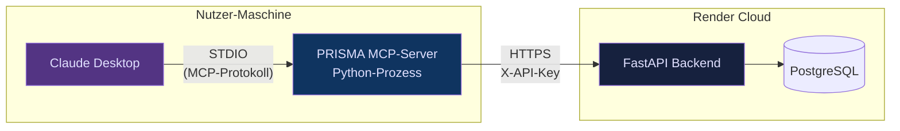

# Spec: MCP-Server (AI Layer 3)

**Status**: Draft v1.0 — 2026-04-21 (für Phase 2, Wo 3)
**Rolle**: B — AI Engineer (Sheyla)
**Parent-Spec**: `docs/specs/2026-04-21-prisma-capstone-design.md` §8.3
**Verwandte Spec**: `docs/specs/2026-04-28-narrative-engine.md`

---

## Inhaltsverzeichnis

1. [Zweck & Nutzerwert](#1-zweck--nutzerwert)
2. [Scope](#2-scope)
3. [Architektur-Übersicht](#3-architektur-übersicht)
4. [Die 4 exponierten Tools](#4-die-4-exponierten-tools)
5. [Transport & Protokoll](#5-transport--protokoll)
6. [Authentifizierung](#6-authentifizierung)
7. [Claude-Desktop-Konfiguration](#7-claude-desktop-konfiguration)
8. [Fehlerbehandlung](#8-fehlerbehandlung)
9. [Test-Strategie](#9-test-strategie)
10. [Observability](#10-observability)
11. [Deployment-Modell](#11-deployment-modell)
12. [Sicherheits-Überlegungen](#12-sicherheits-überlegungen)
13. [Offene Design-Fragen](#13-offene-design-fragen)
14. [Akzeptanz-Kriterien](#14-akzeptanz-kriterien)
15. [Änderungshistorie](#15-änderungshistorie)

---

## 1. Zweck & Nutzerwert

Der MCP-Server ist **der Präsentations-Juwel** von PRISMA: er macht die sonst-browser-gebundene App aus **Claude Desktop heraus natürlichsprachlich nutzbar**. Ein Portfolio Manager tippt in sein Claude-Desktop:

> *"Zeig mir die 5 besten SMI-Aktien aus dem letzten Ranking."*

Claude erkennt, dass das PRISMA-MCP-Tool das beantworten kann, ruft intern `get_ranking_results()` auf, bekommt strukturierte Daten zurück, und formuliert die Antwort. **Ohne dass der User je PRISMAs UI geöffnet hat.**

Das ist nicht nur "cool" — es adressiert direkt den Modul-Lehrstoff: *Agentic AI und MCP*. In der Präsi wird das einer der "Wow"-Momente.

---

## 2. Scope

### In Scope (MVP)

- **4 MCP-Tools** (siehe §4): `run_ranking`, `get_factsheet`, `compare_stocks`, `trigger_backtest`
- Lokaler Python-Prozess, gestartet von Claude Desktop via STDIO
- Der lokale Prozess ruft die **deployed REST-API** auf Render (HTTPS)
- Authentifizierung via geteiltem API-Key (ENV-Var)
- **Tools geben strukturiertes JSON** zurück (keine Freitext-Antworten — Claude formuliert selbst)

### Out of Scope

- HTTP/SSE-Transport (Option für später, aktuell STDIO-only)
- Push-Benachrichtigungen (Claude Desktop polls via Tool-Call, kein Server-Push)
- Multi-User-Session-Isolation (geteilter Team-API-Key reicht für Demo)
- Tool-Composition-Optimierungen (z.B. Caching zwischen Tool-Calls)
- Einzelne LLM-Memo-Generierung via MCP (das Tool wäre redundant — User kann direkt in Claude chatten)

---

## 3. Architektur-Übersicht



**Drei Bausteine**:

1. **Claude Desktop** (nutzt der Benutzer) — nicht von uns gebaut. Konfiguriert via JSON, welche MCP-Server es starten soll.
2. **PRISMA MCP-Server** (wir bauen) — Python-Prozess, der via STDIO MCP-Protokoll spricht. Läuft lokal.
3. **PRISMA REST-API** (haben wir schon) — auf Render deployed. Der MCP-Server ist ein dünner Wrapper, der einzelne REST-Calls zu semantisch-benannten MCP-Tools macht.

**Warum diese Aufteilung?**
- MCP-Server braucht **keinen Zugriff** auf die DB → kein Secret-Sprawl auf Nutzer-Maschine
- Der Nutzer installiert nur einen **Python-Paket** lokal, keine Datenbank, keine Docker-Compose
- Single-Source-of-Truth bleibt die REST-API; der MCP-Server ist reine Übersetzung MCP↔REST

---

## 4. Die 4 exponierten Tools

MCP-Tools haben Name + Beschreibung + Input-Schema (JSON-Schema). Claude lernt damit, wann und wie ein Tool aufzurufen ist.

### 4.1 `run_ranking`

Löst einen neuen Ranking-Run aus.

```python
@mcp.tool()
async def run_ranking(
    universe_id: str,
    weights: dict[str, float] | None = None,
) -> dict:
    """Startet einen neuen Ranking-Lauf auf einem bestehenden Universum.

    Args:
        universe_id: UUID des zu rankenden Universums (z.B. SMI, S&P 500-Subset,
                     Custom-Tickerliste). Über `list_universes` (future) auffindbar.
        weights: Optional. Gewichte pro Modell — z.B.
                 {"quality_classic": 0.20, "alpha": 0.20,
                  "trend_momentum": 0.20, "value_alpha_potential": 0.20,
                  "diversification": 0.20}.
                 Muss zu 1.0 summieren. Fehlt: Gleichgewichtung.

    Returns:
        {
          "model_run_id": "uuid",
          "universe_name": str,
          "n_stocks": int,
          "run_duration_seconds": float,
          "top_10_summary": [
            {"ticker": str, "name": str, "total_rank": int,
             "sweet_spot": bool}, ...
          ]
        }
    """
```

### 4.2 `get_factsheet`

Lädt das aktuelle Factsheet einer Aktie inkl. letztem verfügbarem Memo.

```python
@mcp.tool()
async def get_factsheet(ticker: str) -> dict:
    """Liefert das aktuelle Factsheet einer Aktie.

    Args:
        ticker: Börsen-Ticker (z.B. 'NESN', 'AAPL'). Case-insensitive.

    Returns:
        {
          "ticker": str,
          "name": str,
          "sector": str,
          "country": str,
          "fundamentals": {
            "pe_ratio": float | null,
            "pb_ratio": float | null,
            "dividend_yield": float | null,
            "operating_margin": float | null,
            "debt_equity": float | null,
            "eps_growth_3y": float | null,
            "sales_growth_3y": float | null
          },
          "price_chart_1y": [[date, close_price], ...],
          "latest_memo": null | {
            "model_run_id": "uuid",
            "total_rank": int,
            "one_liner": str,
            "sweet_spot": bool,
            "confidence": "low" | "medium" | "high"
          }
        }
    """
```

### 4.3 `compare_stocks`

Vergleicht mehrere Aktien entlang ihrer Rankings.

```python
@mcp.tool()
async def compare_stocks(
    tickers: list[str],
    model_run_id: str | None = None,
    dimensions: list[str] | None = None,
) -> dict:
    """Vergleicht mehrere Aktien aus demselben ModelRun.

    Args:
        tickers: Liste von 2–10 Tickern. Kleiner als 2 → Fehler.
        model_run_id: Optional. Wenn fehlt: neuester Run für das gemeinsame
                      Universum wird genommen.
        dimensions: Optional. Liste der Modell-Namen zum Filtern — z.B.
                   ['quality_classic', 'trend_momentum', 'diversification'].
                   Fehlt: alle 5 Dimensionen.

    Returns:
        {
          "model_run_id": "uuid",
          "universe_name": str,
          "comparison": [
            {"ticker": str, "name": str, "total_rank": int,
             "rankings": {"quality_classic": int, "alpha": int, ...},
             "sweet_spot": bool}, ...
          ],
          "insight_hints": [
            "Ticker X führt in allen Dimensionen",
            "Ticker Y und Z haben entgegengesetzte Risk-Profile",
            ...
          ]
        }
    """
```

Der `insight_hints`-Array ist **server-seitig regelbasiert** (keine zweite LLM-Call nötig), enthält einfache heuristische Beobachtungen, die Claude als Aufhänger nimmt.

### 4.4 `trigger_backtest`

Startet einen Backtest (asynchron — kommt mit Job-ID, die User nachfragen kann).

```python
@mcp.tool()
async def trigger_backtest(
    universe_id: str,
    start_date: str,   # ISO-Format "2022-01-01"
    end_date: str,
    top_n: int = 10,
) -> dict:
    """Startet einen Backtest (asynchron).

    Args:
        universe_id: UUID des Universums.
        start_date, end_date: ISO-Datumsformat. Mindestens 12 Monate Spanne.
        top_n: Portfolio-Grösse. Default 10.

    Returns:
        {
          "backtest_id": "uuid",
          "status": "queued",
          "estimated_duration_seconds": int,
          "poll_endpoint": "backtest_status"  # Name des zu nutzenden Tools
        }
    """
```

**Hinweis**: Im MVP ist Backtest möglicherweise eine reduzierte statische Variante — siehe Parent-Spec §7.4. In dem Fall liefert `trigger_backtest` sofort Ergebnis statt Job-ID.

---

## 5. Transport & Protokoll

### 5.1 STDIO-Transport

Der MCP-Server liest **newline-delimited JSON** von `stdin` und schreibt Antworten auf `stdout`. Errors gehen nach `stderr`. Das ist der Standard für von Claude Desktop gespawnte Prozesse.

```python
# backend/interfaces/mcp/server.py (Entry-Point)
from mcp.server.fastmcp import FastMCP

mcp = FastMCP("prisma")  # MCP-Server-Name

# ... tool-definitions ...

if __name__ == "__main__":
    mcp.run(transport="stdio")
```

### 5.2 Warum nicht HTTP/SSE?

HTTP/SSE wäre technisch modernerer — MCP 2025-03-26 unterstützt es. Aber:

- Claude Desktop's Integration-Config ist für STDIO am saubersten
- Kein zusätzlicher Port/Firewall-Krampf für den User
- Weniger Auth-Komplexität (STDIO → der User, der Claude Desktop startet, ist der Besitzer)

HTTP/SSE ist als Stretch-Goal dokumentiert.

### 5.3 MCP-Library

`mcp` Python-SDK (Paket `mcp`) in pyproject.toml als Dep ergänzen:

```toml
"mcp>=1.2",
```

Die Library abstrahiert Tool-Registration, JSON-Schema-Generierung aus Python-Type-Hints, Fehler-Serialisierung.

---

## 6. Authentifizierung

### 6.1 Bedrohungsmodell

- Der MCP-Server läuft lokal beim User
- Er ruft die deployed REST-API auf Render auf
- Ohne Auth könnten beliebige Personen die API hämmern → Budget-Abuse, Datenexfiltration

### 6.2 Lösung: Team-API-Key

Ein statisch konfigurierter API-Key, als `PRISMA_API_KEY` Env-Var beim MCP-Server-Start. Wird als `X-API-Key`-Header bei jedem REST-Call an Render gesendet. Auf Backend-Seite prüft eine FastAPI-Dependency.

**Rotation**: bei Bedarf neuer Key generieren, via Render-Dashboard Env-Var updaten. Alle 4 Team-Mitglieder bekommen den aktualisierten Key ins lokale Claude-Desktop-Config.

### 6.3 Key-Verteilung im Team

- **Für Development**: Key in 1Password-Vault des Teams
- **Für Production**: Gleicher Key (1 Team = 1 Key, das reicht für Capstone-Demo)
- **Präsi-Key**: Optional zusätzlicher Key, der nach Präsi rotiert wird (falls Screenshots in GitHub landen)

---

## 7. Claude-Desktop-Konfiguration

Das Team-Dokument `docs/mcp-setup.md` enthält folgendes Snippet für den Claude-Desktop-Config:

**Pfad auf macOS**: `~/Library/Application Support/Claude/claude_desktop_config.json`

```json
{
  "mcpServers": {
    "prisma": {
      "command": "python",
      "args": [
        "-m",
        "backend.interfaces.mcp.server"
      ],
      "cwd": "/Users/YOU/Projects/prisma-capstone",
      "env": {
        "PRISMA_API_URL": "https://prisma-backend-xyz.onrender.com",
        "PRISMA_API_KEY": "pk_live_...",
        "PYTHONPATH": "/Users/YOU/Projects/prisma-capstone"
      }
    }
  }
}
```

Nach Änderung: Claude Desktop neustarten. Im Chat dann: "Hi Claude, kannst du PRISMA-Tools auflisten?" — Claude listet die 4 Tools auf, wenn der Config greift.

**Troubleshooting-Kapitel** in `docs/mcp-setup.md` deckt die häufigsten Fehler ab (Python-Pfad, Env-Vars, Firewall).

---

## 8. Fehlerbehandlung

MCP hat ein definiertes Fehler-Format (JSON-RPC-artig). Unser Mapping:

| Fehler | MCP-Response |
|---|---|
| REST-API nicht erreichbar (Netzwerk) | `{"error": "UPSTREAM_UNAVAILABLE", "retry_after_seconds": 30}` |
| 401 Unauthorized (API-Key falsch) | `{"error": "AUTH_FAILED", "hint": "Check PRISMA_API_KEY env var"}` |
| 404 (z.B. Ticker existiert nicht) | `{"error": "NOT_FOUND", "entity": "Stock", "identifier": <ticker>}` |
| 422 (Input-Validierung bei REST) | `{"error": "INVALID_INPUT", "field": <feld>, "reason": <detail>}` |
| Unerwarteter Fehler | `{"error": "INTERNAL", "request_id": <uuid>}` + Stack-Trace in stderr |

Claude Desktop zeigt dem User eine sinnvolle Nachricht darauf, und kann Error-Hinweise zum User-Prompt zurückspielen ("The tool reported AUTH_FAILED — check your API key").

---

## 9. Test-Strategie

### 9.1 Unit (in PR-CI)

- Jedes Tool einzeln: Mock des REST-Clients, Assertion auf korrekte URL + Header + Body-Mapping
- JSON-Schema-Generierung: prüfen, dass MCP-SDK aus den Python-Type-Hints valide Schemas baut
- Fehler-Mapping: für jede REST-Statuscode-Familie den richtigen MCP-Error-Type produzieren

### 9.2 Integration (in PR-CI)

- MCP-Server wird **im Test-Prozess** gestartet (nicht als externer Subprocess, sondern in-process via `mcp.Client`-Test-Helper)
- Gegen den FastAPI-Test-Client (kein Render, keine echte DB nötig — InMemory-Repos)
- E2E-Flow: "Tool aufrufen → echte REST-Response bekommen → MCP-Response prüfen"

### 9.3 Manuell (nicht automatisiert)

Vor der Präsi:
- MCP-Server auf jedem der 4 Team-Rechner starten lassen
- In Claude Desktop: jedes der 4 Tools mind. 1× via natürlichsprachlichem Prompt triggern
- Screenshots in `docs/mcp-demo-screenshots/`

### 9.4 Abdeckung

- Unit: ≥85%
- Integration: ≥70% (Netzwerk-Code weniger deterministisch)

---

## 10. Observability

Jeder MCP-Tool-Call erzeugt einen Log-Eintrag:

```json
{
  "timestamp": "...",
  "request_id": "req_uuid",
  "tool": "get_factsheet",
  "args": {"ticker": "NESN"},
  "upstream_status": 200,
  "upstream_latency_ms": 340,
  "mcp_response_bytes": 1287,
  "error": null
}
```

Logs landen in `stderr` (STDIO-Transport schreibt App-Output nach `stdout`, Logs gehen separat). Claude Desktop sammelt `stderr` in seinem Debug-Log, User können es im Troubleshooting einsehen.

**Aggregation**: nicht im MVP. Wenn wir später HTTP/SSE nutzen, ist OpenTelemetry-Integration denkbar.

---

## 11. Deployment-Modell

| Komponente | Wo läuft es? | Wer startet es? |
|---|---|---|
| REST-API Backend | Render Web Service | Auto-Deploy bei `main`-Push |
| PostgreSQL | Render Managed DB | immer an |
| Frontend | Render Static Site | Auto-Deploy |
| **MCP-Server** | lokal bei jedem Team-Mitglied | **Claude Desktop**, via `mcpServers`-Config beim Start |

Der MCP-Server ist **kein deployed Service** — er ist Client-Code, der beim User läuft. Dass wir ihn im selben Git-Repo entwickeln ist ein Bequemlichkeits-Entscheid (Type-Sharing mit dem Backend).

Für ein Release: Python-Package via `pipx install git+https://github.com/SheylaSam/prisma-capstone` (Stretch-Goal — im MVP reicht lokaler Editable-Install).

---

## 12. Sicherheits-Überlegungen

- **Der API-Key landet niemals im Repo** — nur in `claude_desktop_config.json` (User-lokal) und Render-Env (Prod-Backend)
- **CORS auf dem Render-Backend**: Der Origin eines MCP-Server-Calls ist nicht ein Browser — CORS ist nicht relevant. Wir validieren nur den API-Key.
- **Rate-Limiting**: Auf der REST-API-Seite Rate-Limit pro API-Key einbauen (z.B. max 60 Requests/Minute), sonst bei Tool-Missbrauch Claude-Desktop-Seiten-Loops teure Server-Last.
- **PII**: Es gibt keine personenbezogenen Daten — die App hat nur synthetische Portfolios und public Aktiendaten. Entsprechend Datenschutz-unkritisch.

---

## 13. Offene Design-Fragen

| # | Frage | Mein Vorschlag | Entscheidung |
|---|---|---|---|
| 1 | Transport: STDIO-only oder auch HTTP/SSE anbieten? | STDIO-only für MVP, HTTP/SSE als Stretch | TBD |
| 2 | 4 Tools reichen — oder noch mehr (z.B. `list_universes`, `get_backtest_status`)? | Start mit 4, bei Demo-Feedback ergänzen | TBD |
| 3 | API-Key: Team-shared oder per User? | Team-shared für Capstone-Demo — per User nur bei Production-Scale nötig | TBD |
| 4 | Rate-Limit-Strategie: Token-Bucket, Fixed-Window, oder nichts im MVP? | Fixed-Window 60/min, einfach zu implementieren | TBD |
| 5 | MCP-Server als separates Python-Package (`pip install prisma-mcp`) oder Teil des Monorepos? | Teil des Monorepos — kein Extra-Artefakt, kein extra CI | **Entschieden** |

Diese Punkte landen in ADR `docs/adr/0003-mcp-server-design.md`.

---

## 14. Akzeptanz-Kriterien

- [ ] MCP-SDK (`mcp>=1.2`) in `pyproject.toml`
- [ ] Entry-Point: `backend/interfaces/mcp/server.py`
- [ ] 4 Tools implementiert mit korrekten Typ-Hints + Docstrings (MCP generiert daraus Schemas)
- [ ] REST-Client-Adapter: `backend/interfaces/mcp/rest_client.py` (async httpx mit API-Key-Header)
- [ ] Fehler-Mapping für 5 Fehler-Typen aus §8
- [ ] Unit-Tests ≥85% Coverage
- [ ] Integration-Tests gegen FastAPI-Test-Client
- [ ] Manuelle E2E-Demo: 4 Tools je 1× aus Claude Desktop getriggert, Screenshots archiviert
- [ ] `docs/mcp-setup.md` mit:
  - Claude-Desktop-Config-Snippet
  - Troubleshooting (Python-Pfad, Env-Vars, API-Key)
  - Rate-Limit-Hinweise
- [ ] FastAPI-Backend: Rate-Limit-Middleware aktiv (60/min pro API-Key)
- [ ] Render-Env: `PRISMA_API_KEY` gesetzt (nicht im Repo)
- [ ] `docs/mcp-demo-screenshots/` — mind. 4 Screenshots je Tool
- [ ] Demo-Skript in `docs/mcp-demo-script.md`: 5 natürlichsprachliche Prompts für die Präsi, die verschiedene Tools triggern (z.B. *"Welche SMI-Titel sind aktuell im Quant Sweet Spot?"* → nutzt `run_ranking` oder `compare_stocks`)

---

## 15. Änderungshistorie

| Version | Datum | Autor | Änderung |
|---|---|---|---|
| Draft v1.0 | 2026-04-21 | Claude Code für Sheyla | Initiale Spec |
