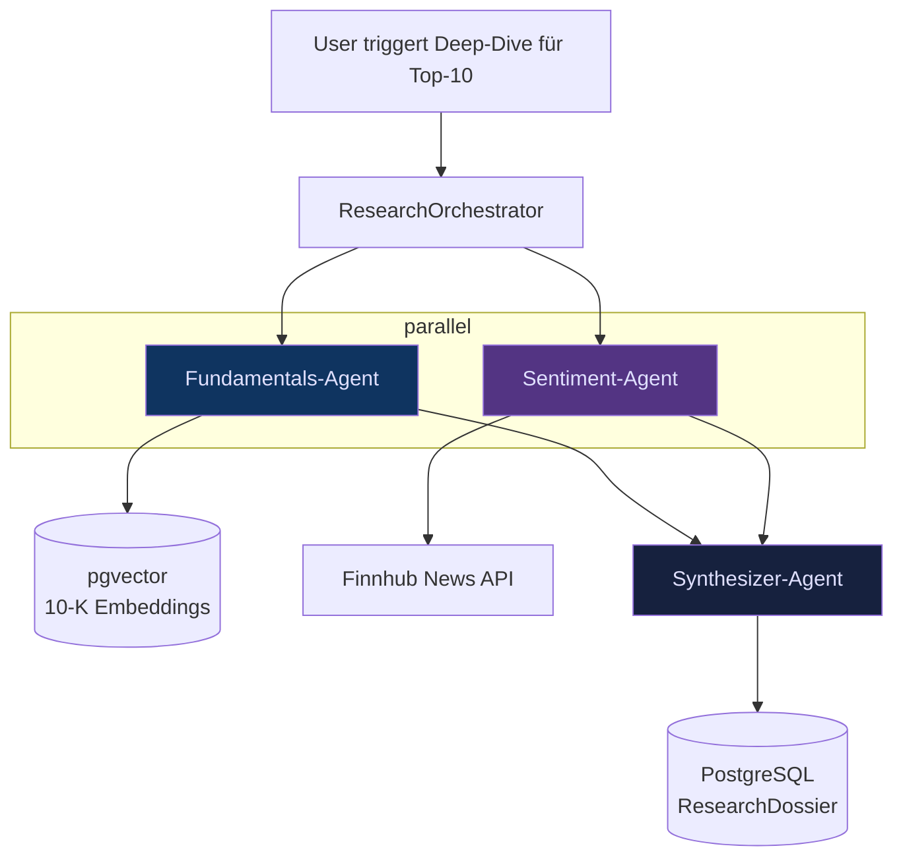
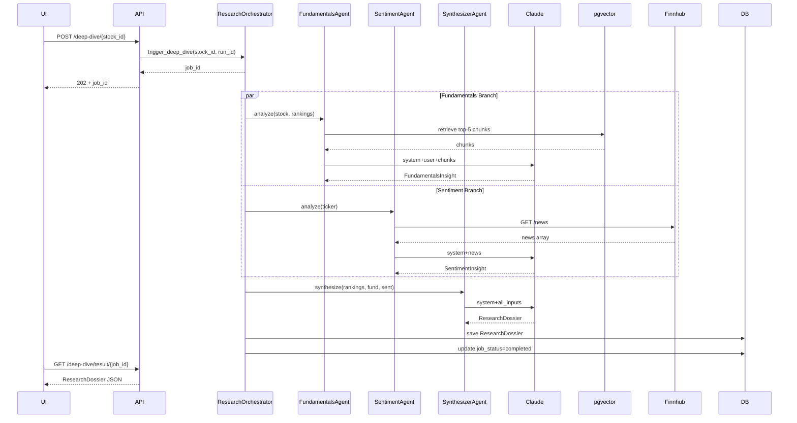

# Spec: Multi-Agent Research Pipeline (AI Layer 2)

**Status**: Draft v1.0 — 2026-04-21 (für Phase 2, Wo 3)
**Rolle**: B — AI Engineer (Sheyla)
**Parent-Spec**: `docs/specs/2026-04-21-prisma-v2-design.md` §8.2
**Verwandte Specs**:
- `docs/specs/2026-04-28-narrative-engine.md` (Layer 1)
- `docs/specs/2026-04-28-mcp-server.md` (Layer 3)

---

## Inhaltsverzeichnis

1. [Zweck & Nutzerwert](#1-zweck--nutzerwert)
2. [Scope](#2-scope)
3. [Agent-Topologie](#3-agent-topologie)
4. [Fundamentals-Agent](#4-fundamentals-agent)
5. [Sentiment-Agent](#5-sentiment-agent)
6. [Synthesizer-Agent](#6-synthesizer-agent)
7. [Orchestrierung](#7-orchestrierung)
8. [RAG-Infrastruktur](#8-rag-infrastruktur)
9. [Output-Schema](#9-output-schema)
10. [Service-API](#10-service-api)
11. [Fehlerbehandlung](#11-fehlerbehandlung)
12. [Test-Strategie](#12-test-strategie)
13. [Observability & Kosten](#13-observability--kosten)
14. [Data-Flow](#14-data-flow)
15. [Offene Design-Fragen](#15-offene-design-fragen)
16. [Akzeptanz-Kriterien](#16-akzeptanz-kriterien)
17. [Änderungshistorie](#17-änderungshistorie)

---

## 1. Zweck & Nutzerwert

Die Narrative Engine (Layer 1) produziert pro Aktie ein **kompaktes Memo** basierend ausschliesslich auf den Ranking-Zahlen. Das ist wertvoll, aber oberflächlich: "Diese Aktie hat Quality-Rank 3 und Alpha-Rank 7." Was **fehlt**: *Warum* ist das so? Was steht in ihren Geschäftsberichten? Was sagen die News?

Die **Multi-Agent-Pipeline** schliesst diese Lücke. Für die **Top-10** eines ModelRuns orchestriert sie drei spezialisierte Agenten:

- **Fundamentals-Agent** liest die letzten Geschäftsberichte (10-K, 10-Q) via RAG und extrahiert die treibenden Narrative
- **Sentiment-Agent** analysiert aktuelle News und ordnet Markt-Stimmung ein
- **Synthesizer-Agent** aggregiert beide Quellen zu einem zitierten Dossier

Das Ergebnis ist ein **2-seitiges Research-Dossier pro Aktie**, mit Quellenzitaten zu jeder Aussage — tiefer als das Layer-1-Memo, aber immer noch maschinell erzeugt und innerhalb von ~60 Sekunden verfügbar.

**Warum das für euer Modulprojekt zählt**: Multi-Agent-Kollaboration ist einer der Modul-Lehrstoffe (Kapitel "Agentic AI & MCP"). Diese Pipeline ist das deutlichste Produkt-Feature, das den Lehrstoff direkt adressiert.

---

## 2. Scope

### In Scope (MVP)

- **3 Agenten** (Fundamentals, Sentiment, Synthesizer) mit klar getrennten Verantwortlichkeiten
- **RAG über 10-K/10-Q-PDFs** via pgvector, Voyage-Embeddings
- **News-Abruf** via Finnhub Free Tier
- **Parallelisierte Ausführung**: Fundamentals + Sentiment laufen gleichzeitig, Synthesizer danach
- Für **Top-10 eines ModelRuns** on-demand startbar (manueller Button im Frontend)
- Strukturiertes **Dossier-Schema** (Pydantic) mit Quellenzitaten
- Persistenz in `ResearchDossier`-Entity

### Out of Scope

- Mehr als 3 Agenten (Macro-Agent, Technical-Chart-Agent wären denkbar — Stretch)
- Voll-automatisches Running für alle Aktien im Universum (Kosten)
- Agent-Debates / iterative Kritik-Zyklen (Stretch für später)
- Mehrsprachigkeit (Deutsch only)
- Real-time Streaming (Ergebnis kommt als ein Stück, nicht Token-by-Token)
- Ingestion von Nicht-US-Aktien-Filings (SEC EDGAR ist US-fokussiert — CH/EU-Firmen haben keine 10-Ks, Fundamentals-Agent fällt für sie zurück auf öffentliche Jahresberichts-PDFs, manuell nachladbar)

---

## 3. Agent-Topologie



**Kern-Design-Idee**: **jeder Agent hat genau EINE Verantwortung und EINE Datenquelle**. Das macht Testing, Fehlerlokalisation und Evaluation einfacher als ein einzelner "Super-Agent", der alles gleichzeitig tut.

---

## 4. Fundamentals-Agent

**Rolle**: Liefert fundamentale Einsicht ins Geschäftsmodell, zuletzt berichtete Zahlen und Management-Aussagen.

### 4.1 Input

- `ticker` + `name` der Aktie
- Die 5 Modell-Rankings (damit der Agent weiss, wo Stärken/Schwächen vermutet werden)

### 4.2 Vorgehen

1. Zieht die letzten 2 **10-K** und 2 **10-Q**-Filings der Firma aus unserem pgvector-Index (falls vorhanden — bei fehlendem Index Fallback auf Hinweis "Keine Filings indexiert")
2. Bildet aus der Anfrage (z.B. "Warum hat diese Firma hohen Debt/Equity?") eine **RAG-Query** (Embedding-Ähnlichkeitssuche)
3. Top-5 Chunks (je ~500 Tokens) werden in den Claude-Prompt eingebettet
4. Claude Sonnet 4.6 produziert strukturierten Output mit:
   - Geschäftsmodell-Summary (2–3 Sätze)
   - Jüngste Finanz-Highlights (Revenue, Margin-Entwicklung)
   - Top-3 Risikofaktoren gemäss Filing
   - **Quellenzitate** (Filing-Typ + Datum + Seite/Chunk-ID) zu jeder Aussage

### 4.3 Output-Schema

```python
class Citation(BaseModel):
    source_type: Literal["10-K", "10-Q", "news"]
    source_date: date
    reference: str  # Seite/Paragraf/URL
    quote: str = Field(..., max_length=300)

class FundamentalsInsight(BaseModel):
    business_summary: str = Field(..., max_length=400)
    financial_highlights: list[str] = Field(..., max_length=5)
    risk_factors: list[str] = Field(..., max_length=3)
    citations: list[Citation]
    confidence: Literal["low", "medium", "high"]
```

### 4.4 Kosten

Pro Aktie (geschätzt):
- 5 Chunks × ~500 Tokens = 2500 Tokens User-Prompt (uncached)
- System-Prompt ~1500 Tokens (cached nach erstem Call)
- Output ~600 Tokens
- **Kosten**: erster Call ~$0.021, subsequent ~$0.015

---

## 5. Sentiment-Agent

**Rolle**: Fasst aktuelle Nachrichten-Stimmung zusammen und extrahiert erwähnenswerte Events.

### 5.1 Input

- `ticker`
- Zeitfenster (Default: letzte 30 Tage)

### 5.2 Vorgehen

1. Ruft Finnhub `/news` für den Ticker im Zeitfenster
2. Top 20 Headlines + Summaries (wenn verfügbar)
3. Claude Sonnet 4.6 klassifiziert:
   - **Übergreifende Stimmung**: bullish / neutral / bearish
   - **Sentiment-Score**: numerisch -1.0 bis +1.0
   - **Wichtigste 3 Events**: kurz beschrieben, mit URL-Zitat
   - **Unüblich / Alarm-Signale**: z.B. SEC-Investigations, CEO-Wechsel, etc.

### 5.3 Output-Schema

```python
class SentimentInsight(BaseModel):
    overall_sentiment: Literal["bullish", "neutral", "bearish"]
    sentiment_score: float = Field(..., ge=-1.0, le=1.0)
    key_events: list[Citation]  # mit URLs in reference
    alarm_signals: list[str] = Field(default_factory=list)
    news_count_analyzed: int
    confidence: Literal["low", "medium", "high"]
```

### 5.4 Kosten

Pro Aktie: ~$0.012 (kürzerer Output als Fundamentals)

### 5.5 Finnhub-Rate-Limit

Free Tier = 60 Calls/Minute. Für 10 Aktien = 10 Calls, unkritisch. Aggressives Caching der Responses in PostgreSQL (TTL 4h), damit mehrfache Deep-Dives im selben Zeitfenster keine zusätzlichen Calls auslösen.

---

## 6. Synthesizer-Agent

**Rolle**: Integriert die beiden Sichtweisen zu einem kohärenten Dossier.

### 6.1 Input

- Das ursprüngliche Ranking-Bild (wie bei Layer 1 Narrative)
- Die `FundamentalsInsight`-Ausgabe
- Die `SentimentInsight`-Ausgabe

### 6.2 Vorgehen

1. Claude Sonnet 4.6 liest alle drei Inputs
2. Produziert einen **3-Teile-Dossier**:
   - **Executive Summary** (3–5 Sätze, für Busy Reader)
   - **Deep-Dive-Analyse**: pro Kategorie (Quality, Trend, Value, Risk) ein Absatz, der Rankings mit Fundamentals/Sentiment verknüpft
   - **Widersprüche & Offene Fragen** (wenn Fundamentals-Agent sagt "Starkes Wachstum" aber Sentiment-Agent "bearish News" — das wird explizit geflaggt)
3. **Alle Quellen werden zitiert** (Zitate aus Fundamentals + News werden durchgereicht)

### 6.3 Output

Das finale `ResearchDossier`-Schema (siehe §9).

### 6.4 Kosten

Pro Aktie: ~$0.018 (längerer Output, aber keine RAG-Kosten)

### 6.5 Warum nicht ein einzelner Mega-Agent?

Technisch könnten wir Fundamentals + Sentiment + Synthesizer in **einen** einzigen Claude-Call bündeln. Gegen diesen Ansatz:

- **Kontext-Fenster**: Alle RAG-Chunks + News + Synthese zusammen ist viel Token — teurer *und* weniger fokussiert
- **Fehlerlokalisation**: wenn das Dossier schlecht ist, weiss man nicht, welche Komponente schuld ist
- **Parallelisierung**: Fundamentals und Sentiment können **gleichzeitig** laufen (unterschiedliche Daten-Quellen) — spart Latenz
- **Modul-Lehrstoff**: explizit Multi-Agent ist ein **Lehr-Ziel** des Moduls, kein Nice-to-have

---

## 7. Orchestrierung

### 7.1 Framework-Entscheid

**Kein LangGraph, kein CrewAI im MVP.** Stattdessen: direktes `asyncio` mit Anthropic SDK + expliziter State-Machine in Python.

Gründe:
- LangGraph bringt Framework-Abhängigkeit + Lernkurve
- Unsere Topologie ist simpel (2-fan-out → 1-merge) — LangGraph würde nicht beschleunigen
- Transparenz: Team liest 80 Zeilen Python, nicht ein LangGraph-YAML + 40 Zeilen Wrapper
- Prüfer/Dozent sehen in der Präsi, was läuft — nicht eine Framework-Abstraktion

### 7.2 Pseudo-Code der Orchestrierung

```python
async def run_deep_dive(stock_id: UUID, model_run_id: UUID) -> ResearchDossier:
    stock = await stock_repo.get(stock_id)
    rankings = await ranking_repo.get_for_stock(stock_id, model_run_id)

    # Parallel-Fan-Out
    fundamentals_task = asyncio.create_task(
        fundamentals_agent.analyze(stock, rankings)
    )
    sentiment_task = asyncio.create_task(
        sentiment_agent.analyze(stock.ticker)
    )

    # Warten auf beide
    fundamentals, sentiment = await asyncio.gather(
        fundamentals_task,
        sentiment_task,
        return_exceptions=True,  # ein Agent-Fail bricht nicht alles
    )

    # Fehler-Behandlung (siehe §11): wenn ein Agent failed → Partial-Dossier mit Error-Note
    fundamentals = _handle_agent_result(fundamentals, label="fundamentals")
    sentiment = _handle_agent_result(sentiment, label="sentiment")

    # Synthesizer (sequenziell)
    dossier = await synthesizer_agent.synthesize(
        stock=stock,
        rankings=rankings,
        fundamentals=fundamentals,
        sentiment=sentiment,
    )

    # Persistieren
    await dossier_repo.save(dossier)
    return dossier
```

### 7.3 Concurrency-Limit bei Batch-Runs

Bei Top-10 Batch: **max 3 gleichzeitige Deep-Dives** (Semaphore). Jedes Deep-Dive macht intern 2 parallele LLM-Calls + 1 sequenziellen. Bei 3 parallelen Deep-Dives = 6 parallele LLM-Calls gleichzeitig — bleibt unter Anthropic Rate Limit (Tier-1 Limit: 50 Req/Min für Sonnet).

---

## 8. RAG-Infrastruktur

### 8.1 Dokument-Ingestion

Separater Batch-Job, NICHT Teil der Deep-Dive-Pipeline (asynchron vorbereitet):

1. **SEC EDGAR** Web-Scraping: für jeden Ticker die URL zu den letzten 10-Ks/10-Qs bekommen
2. **PDF-Parser**: `pypdf2` oder `pdfplumber` — Text extrahieren, Seitenzahlen behalten
3. **Chunking**: nach Sektion (Item 1A "Risk Factors", Item 7 "MD&A", etc.) + Sekundär-Split nach 500-Token-Stücken mit 100-Token-Overlap
4. **Embedding**: Voyage AI `voyage-3-large` (2048-dim), via `voyageai`-Python-Client
5. **Persistenz**: pgvector-Extension, Tabelle `document_chunks(id, ticker, filing_type, filing_date, section, page_num, chunk_text, embedding)`, HNSW-Index auf `embedding`

### 8.2 Retrieval

Für eine Agent-Query:
```sql
SELECT chunk_text, filing_type, filing_date, page_num
FROM document_chunks
WHERE ticker = :ticker
  AND filing_date >= :min_date
ORDER BY embedding <=> :query_embedding  -- cosine distance
LIMIT 5;
```

Die Top-5 Chunks landen als **Context-Block** im Agent-Prompt.

### 8.3 Initial-Corpus für Demo

Für MVP-Demo: **5 grosse US-Firmen** (AAPL, MSFT, GOOGL, NVDA, JPM) mit je 2 letzten 10-K und 2 letzten 10-Q → ~20 Dokumente, ~200 MB PDFs, ~4000 Chunks, ~8 MB Embeddings in pgvector. Ingestion läuft einmalig manuell (~30 Min), Ergebnis in DB.

Für CH/EU-Aktien: **Fundamentals-Agent liefert partielles Ergebnis** mit Hinweis "Kein Filing-Korpus indexiert für diese Region — nur Ranking-Interpretation".

### 8.4 Kosten Embedding

Voyage AI: ~$0.12 / 1 M Tokens. Initial Corpus 4000 Chunks × 500 Tokens = 2 M Tokens = **$0.24** einmalig. Query-Embeddings: vernachlässigbar.

---

## 9. Output-Schema

Das finale `ResearchDossier`:

```python
class DossierSection(BaseModel):
    category: Literal["quality", "trend", "value", "risk"]
    text: str = Field(..., min_length=100, max_length=800)
    citations: list[Citation]

class Contradiction(BaseModel):
    finding_a: str  # z.B. "Fundamentals: starkes Umsatzwachstum"
    finding_b: str  # z.B. "Sentiment: bearish news wegen Management-Austritt"
    source_a: Citation
    source_b: Citation
    comment: str = Field(..., max_length=300)

class ResearchDossier(BaseModel):
    stock_ticker: str
    model_run_id: UUID

    executive_summary: str = Field(..., min_length=200, max_length=800)

    fundamentals_insight: FundamentalsInsight  # Sub-Schema aus §4
    sentiment_insight: SentimentInsight        # Sub-Schema aus §5

    deep_dive: list[DossierSection]  # 2-4 Abschnitte

    contradictions: list[Contradiction]

    overall_confidence: Literal["low", "medium", "high"]

    # Meta
    agents_succeeded: list[str]  # z.B. ["fundamentals", "sentiment", "synthesizer"]
    agents_failed: list[str]     # leer bei Happy-Path
    generated_at: datetime
    total_cost_usd: float        # summiert aus allen Agent-Calls
```

---

## 10. Service-API

```python
# backend/application/services/research_agent_service.py

class ResearchAgentService:
    async def trigger_deep_dive(
        self,
        stock_id: UUID,
        model_run_id: UUID,
    ) -> UUID:  # Job-ID (async)
        """Startet einen Deep-Dive-Job. Gibt Job-ID zurück für Polling."""

    async def get_deep_dive_status(
        self,
        job_id: UUID,
    ) -> DeepDiveStatus:  # pending / running / completed / failed
        ...

    async def get_deep_dive_result(
        self,
        job_id: UUID,
    ) -> ResearchDossier:
        ...

    async def batch_deep_dive_top_n(
        self,
        model_run_id: UUID,
        top_n: int = 10,
    ) -> list[UUID]:  # list of Job-IDs
        ...
```

### REST-Endpoints

| Method | Pfad | Beschreibung |
|---|---|---|
| POST | `/api/v1/deep-dive/{stock_id}` | Einzel-Deep-Dive starten (async job) |
| POST | `/api/v1/deep-dive/batch` | Batch für Top-N starten |
| GET | `/api/v1/deep-dive/status/{job_id}` | Job-Status polling |
| GET | `/api/v1/deep-dive/result/{job_id}` | Fertiges Dossier abrufen |

### Warum async Jobs?

Ein Deep-Dive dauert ~30–60 s (2 parallele LLM-Calls + Synthesizer). Bei Top-10 = bis zu 10 × 60 s seriell, parallelisiert mit Concurrency-3 ≈ 3–5 Minuten. Zu lang für HTTP-Request-Response. Deshalb: **Job-Queue** (in-process für MVP, Celery/Arq später).

---

## 11. Fehlerbehandlung

### 11.1 Partial-Success-Prinzip

**Wenn ein Agent failt, geht die Pipeline weiter** (Partial-Dossier mit Error-Note). Gründe:

- Fundamentals-Agent kann legitimiert failen (CH-Aktien ohne 10-K-Corpus)
- Sentiment-Agent kann legitim failen (Finnhub Rate Limit in Extremfällen)
- Synthesizer kann mit nur 1 Input-Quelle immer noch ein reduziertes Dossier bauen

### 11.2 Fehler-Matrix

| Fehler | Ort | Auswirkung | Reaktion |
|---|---|---|---|
| RAG: kein Corpus für Ticker | Fundamentals | Agent liefert Stub mit "no_corpus_available: true" | Pipeline geht weiter |
| Finnhub Rate Limit | Sentiment | nach 3 Retries Abbruch | `agents_failed=["sentiment"]`, Synthesizer läuft mit nur Fundamentals |
| Claude Rate Limit (429) | alle | Exponential Backoff, max 3 Retries | bei Fail: ganzer Agent geht als failed |
| Claude Timeout | alle | 60 s Budget pro Call, hard-fail | Agent failed |
| Pydantic-Validation-Fehler | alle | LLM-Output malformed → raw in log | Agent liefert Stub, failed-Marker |
| Budget-Cap erreicht | Orchestrator | Job wird nicht gestartet | HTTP 429 an User, Hinweis-Text |
| DB-Unavailable | Orchestrator | kein Persist möglich | Job-Status=failed, Logs |

### 11.3 Synthesizer bei degradiertem Input

Der Synthesizer-Prompt hat explizite Handling-Regeln:

> "Wenn `fundamentals_available=false`: überspringe Fundamentals-Section, erkläre im Executive Summary, dass kein Filing-Corpus verfügbar war."

Damit hat auch ein halbes Dossier Produkt-Wert und bricht nicht das ganze Feature.

---

## 12. Test-Strategie

### 12.1 Unit (in PR-CI)

- Pydantic-Schemas: Edge-Cases (leere Listen, Unicode-Zitate, Lang-Limits)
- Prompt-Building pro Agent: Snapshot-Tests
- Orchestrator-State-Machine: Mock-Agenten liefern kanonische Inputs, prüfe Fehler-Pfade
- RAG-Retrieval-Logic: pgvector-Query-Builder, Distance-Thresholds

### 12.2 Integration (in PR-CI)

- **Fixture-Mode für LLM-Calls**: aufgenommene Claude-Responses je Agent
- **In-Memory RAG**: 3 Test-Chunks direkt in Code, kein echtes pgvector
- Testdaten-Test-Cases:
  - Happy-Path: alle 3 Agenten erfolgreich
  - Sentiment-Failure: Finnhub simulated down
  - Fundamentals-Failure: kein Corpus
  - Full-Failure: beide Agenten failen → Dossier mit `executive_summary` nur aus Ranking-Zahlen

### 12.3 E2E-Test (in PR-CI, via Playwright)

- User klickt in UI "Deep Dive starten"
- Frontend zeigt Polling-Indicator
- Nach Mock-Completion: Dossier erscheint

### 12.4 LLM-Quality-Tests (nicht in CI)

- 3 Referenz-Stocks mit manuell annotiertem "Ground-Truth"-Dossier
- Wöchentlicher Cron-Run gegen echte APIs
- LLM-as-Judge: Zweiter Claude-Call bewertet Zitiergenauigkeit (Halluzinations-Detektor)

### 12.5 Coverage-Ziel

- Unit: ≥85% (Orchestrator-Logik + Schemas)
- Integration: ≥75%
- Gesamt: ≥80%

---

## 13. Observability & Kosten

### 13.1 Kosten-Budget

Pro Top-10 Deep-Dive Batch:

| Posten | Schätzung |
|---|---|
| 10× Fundamentals | 10 × $0.017 ≈ $0.17 |
| 10× Sentiment | 10 × $0.012 ≈ $0.12 |
| 10× Synthesizer | 10 × $0.018 ≈ $0.18 |
| RAG Query-Embeddings | < $0.01 |
| **Total pro Batch** | **≈ $0.48** |

**Projektbudget-Prognose**: 3 Voll-Demos + 5 Dev-Tests = 8 Batches × $0.5 = **~$4 gesamt**. Zusammen mit Narrative Engine (~$4) = **~$8 gesamt** Claude-API-Kosten für AI-Features. **Plus einmalig $0.24 Embedding-Ingestion**. Grosszügiger Anthropic-Cap: **$30/Monat**.

### 13.2 Logging pro Deep-Dive

```json
{
  "job_id": "uuid",
  "ticker": "NESN",
  "model_run_id": "uuid",
  "total_duration_seconds": 54.3,
  "agents": {
    "fundamentals": {"status": "ok", "duration_s": 28.1, "tokens": {...}, "cost_usd": 0.0187},
    "sentiment": {"status": "ok", "duration_s": 12.4, "tokens": {...}, "cost_usd": 0.0121},
    "synthesizer": {"status": "ok", "duration_s": 13.8, "tokens": {...}, "cost_usd": 0.0184}
  },
  "total_cost_usd": 0.0492,
  "rag_chunks_retrieved": 5,
  "rag_avg_distance": 0.23,
  "cache_hit_ratio": 0.85
}
```

Alle Einträge landen in `llm_usage_log` (geteilte Tabelle mit Narrative Engine, siehe deren Spec §11).

### 13.3 Real-Time-Status-Tracking

Frontend pollt `/api/v1/deep-dive/status/{job_id}` alle 3 s. Status-Feld zeigt:
- `queued`
- `running: fundamentals_in_progress`
- `running: sentiment_in_progress`
- `running: synthesizing`
- `completed`
- `failed` (+ error-details)

So sieht der User Progress statt nur Spinner.

---

## 14. Data-Flow



---

## 15. Offene Design-Fragen

| # | Frage | Mein Vorschlag | Entscheidung |
|---|---|---|---|
| 1 | Framework-Wahl: pure asyncio, LangGraph, CrewAI? | **pure asyncio** — Transparenz > Framework | **Entschieden** (Spec §7.1) |
| 2 | Top-N Default bei Batch-Deep-Dive: 5 oder 10? | **10** — passt zu "Top Quant Sweet Spots" | TBD |
| 3 | RAG-Corpus: nur US-Firmen (5 Ticker) oder mehr? | 5 Ticker im MVP (Kosten/Zeit) — mehr als Stretch | TBD |
| 4 | Alternative zu Voyage-Embeddings: OpenAI, Cohere, lokal? | Voyage (Anthropic-empfohlen, günstig) | TBD |
| 5 | Job-Queue: in-process asyncio, Celery, Arq? | In-process für MVP, Arq als Stretch | TBD |
| 6 | Soll Synthesizer schon einen Layer-1-Memo erhalten (falls vorhanden), oder von null? | Ja, falls Layer-1-Memo existiert, als zusätzlicher Input-Kontext | TBD |
| 7 | Kostenkontrolle bei Batch: hart cap oder pro-Aktie-Kosten-Geschwister-Prüfung? | Hart cap (Abbruch bei Überschreitung), einfacher | TBD |

Diese Punkte landen in ADR `docs/adr/0004-multi-agent-pipeline-design.md`.

---

## 16. Akzeptanz-Kriterien

- [ ] Pydantic-Schemas für `FundamentalsInsight`, `SentimentInsight`, `ResearchDossier`, `Citation`
- [ ] `ResearchDossier`-Entity + SQLAlchemy-Modell + Alembic-Migration
- [ ] `ResearchDossierRepository` Interface + SQLA-Implementation
- [ ] 3 Agent-Klassen in `backend/application/services/agents/`:
  - `fundamentals_agent.py`
  - `sentiment_agent.py`
  - `synthesizer_agent.py`
- [ ] Orchestrator in `backend/application/services/research_agent_service.py`
- [ ] RAG-Infrastruktur:
  - `document_chunks`-Tabelle mit pgvector-Spalte
  - HNSW-Index
  - Ingestion-Script `scripts/ingest_edgar.py`
  - Voyage-Embedding-Adapter
- [ ] Finnhub-Adapter in `backend/infrastructure/news/finnhub_client.py`
- [ ] 4 REST-Endpunkte aus §10 live, im Swagger sichtbar
- [ ] Job-Queue (in-process) mit Status-Polling
- [ ] Frontend: "Deep Dive starten"-Button + Polling-UI + Dossier-Anzeige
- [ ] Unit-Tests Coverage ≥85%
- [ ] Integration-Tests mit Fixtures Coverage ≥75%
- [ ] E2E-Test: User klickt, Dossier erscheint (Mock-Agents)
- [ ] 5 Ticker initial-corpus indexiert (AAPL, MSFT, GOOGL, NVDA, JPM)
- [ ] Kosten-Log pro Deep-Dive in `llm_usage_log`-Tabelle
- [ ] Beispiel-Dossier in `docs/examples/research-dossier-sample.json`
- [ ] AI-USAGE.md-Eintrag nach Implementation

---

## 17. Änderungshistorie

| Version | Datum | Autor | Änderung |
|---|---|---|---|
| Draft v1.0 | 2026-04-21 | Claude Code für Sheyla | Initiale Spec |
