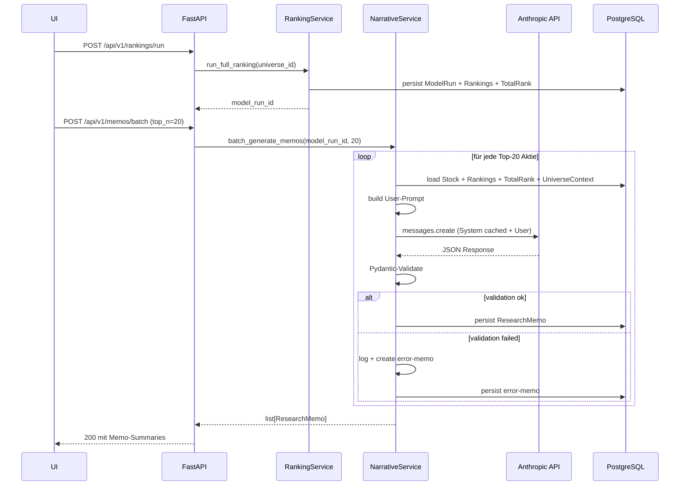

# Spec: Narrative Engine (AI Layer 1)

**Status**: Draft v1.0 — 2026-04-21 (für Phase 2, Wo 2)
**Rolle**: B — AI Engineer (Sheyla)
**Parent-Spec**: `docs/specs/2026-04-21-prisma-capstone-design.md` §8.1

---

## Inhaltsverzeichnis

1. [Zweck & Nutzerwert](#1-zweck--nutzerwert)
2. [Scope](#2-scope)
3. [Input-Kontrakt](#3-input-kontrakt)
4. [Output-Kontrakt (Pydantic-Schema)](#4-output-kontrakt-pydantic-schema)
5. [Prompt-Design](#5-prompt-design)
6. [Prompt-Caching-Strategie](#6-prompt-caching-strategie)
7. [Modell-Wahl](#7-modell-wahl)
8. [Service-API](#8-service-api)
9. [Fehlerbehandlung](#9-fehlerbehandlung)
10. [Test-Strategie](#10-test-strategie)
11. [Observability & Kosten](#11-observability--kosten)
12. [Data-Flow](#12-data-flow)
13. [Offene Design-Fragen](#13-offene-design-fragen)
14. [Akzeptanz-Kriterien](#14-akzeptanz-kriterien)
15. [Änderungshistorie](#15-änderungshistorie)

---

## 1. Zweck & Nutzerwert

PRISMA produziert für jeden ModelRun eine Tabelle mit 5 quantitativen Rängen pro Aktie. Ein Portfolio Manager, der 100 Titel vergleicht, sieht 500 Zahlen — das ist schnell zu viel. Die **Narrative Engine** übersetzt diese numerischen Muster in strukturierte natürliche Sprache:

- **"Was ist das Kernbild dieser Aktie?"** (one-liner)
- **"Wo liegen Stärken?"** (key_strengths)
- **"Wo sind Widersprüche?"** (contradictions — Rang-Divergenz zwischen Kategorien)
- **"Ist das ein Quant Sweet Spot?"** (ja/nein + Erklärung)

Das ist kein Ersatz für die Tabelle, sondern eine **Einstiegshilfe**: auf einen Blick den Charakter einer Aktie erfassen, bevor man die Zahlen studiert.

---

## 2. Scope

### In Scope (MVP)

- Für die Top-N Aktien eines ModelRuns wird genau **ein strukturiertes Memo** generiert (Default N=20)
- Claude API mit aktiviertem **Prompt Caching** auf dem System-Prompt
- **Structured Output** via Pydantic-Schema-Validation (kein Freitext ohne Schema)
- Persistenz in der `ResearchMemo`-Entity (einmal generiert → wiederverwendet)
- REST-Endpunkte: einzelne Generierung, Batch-Generierung, Abruf
- Re-Generierung erzwingbar via expliziter Flag (POST)

### Out of Scope

- **Multi-Agent Deep-Dive** (separate Spec für Layer 2 — nutzt *diesen* Memo-Output als Startpunkt)
- **MCP-Zugriff** (separate Spec für Layer 3)
- Real-time Streaming-Output (nur komplette Memos)
- Nutzer-Custom-Prompts / "ich will einen pessimistischeren Ton"
- **UI-Internationalisierung** (Next.js i18n): bleibt Stretch-Goal
- **Englische Memo-Generierung im MVP**: Architektur ist bilingual vorbereitet (siehe unten), aber der Default und die einzige ausgelieferte Variante im MVP ist Deutsch

### Sprach-Architektur-Notiz

Der `NarrativeService` akzeptiert von Anfang an einen `lang: Literal["de", "en"]`-Parameter mit Default `"de"`. Beide System-Prompt-Templates (`narrative_system.de.md.j2` und `narrative_system.en.md.j2`) existieren in der Struktur, aber nur die DE-Variante wird im MVP ausgefüllt und produktiv getestet. Nachzulegen in <2 h Arbeit, sobald UI-i18n verfügbar ist.

---

## 3. Input-Kontrakt

Was der `NarrativeService` vom `RankingService` erhält:

| Feld | Typ | Herkunft |
|---|---|---|
| `model_run_id` | UUID | für Zuordnung + Reproduzierbarkeit |
| `stock` | `Stock`-Entity | Metadaten (Ticker, Name, Sektor, Country) |
| `rankings` | `list[ModelRanking]` | 5 Einträge: je Modell Score + Rang |
| `total_rank` | `TotalRank` | aggregierter Rang + sweet_spot-Flag + weights-Snapshot |
| `universe_context` | `UniverseContext` | Verteilungs-Metadaten (N, Median-Rang, Top-20%-Schwelle) — **nicht** die gesamte Ranking-Tabelle |

Wichtig: Wir schicken der LLM **nicht** die Ränge aller anderen Aktien (Token-Kosten + Datenschutz). Stattdessen: nur aggregierte Statistiken über das Universum, gerade genug um "Top 20%" sinnvoll zu kontextualisieren.

---

## 4. Output-Kontrakt (Pydantic-Schema)

```python
from datetime import datetime
from typing import Literal
from pydantic import BaseModel, Field


class ContradictionItem(BaseModel):
    """Ein Modell-zu-Modell-Widerspruch, der Aufmerksamkeit verdient."""
    model_a: str = Field(..., description="Name des ersten Modells (z.B. 'Quality Classic')")
    model_b: str = Field(..., description="Name des zweiten Modells")
    description: str = Field(..., min_length=20, max_length=200,
                             description="1-2 Sätze, was der Widerspruch konkret bedeutet")


class ResearchMemoSchema(BaseModel):
    """Strukturierter LLM-Output der Narrative Engine."""

    ticker: str = Field(..., min_length=1, max_length=10)
    total_rank: int = Field(..., ge=1)

    one_liner: str = Field(..., min_length=10, max_length=150,
                           description="Einzeiler-Zusammenfassung, lesbar auf einem Blick")

    ranking_interpretation: str = Field(..., min_length=100, max_length=600,
                                         description="3-5 Sätze, je Kategorie ein Statement")

    sweet_spot: bool
    sweet_spot_explanation: str | None = Field(None, max_length=300,
                                                description="Nur wenn sweet_spot=True: warum?")

    contradictions: list[ContradictionItem] = Field(default_factory=list, max_length=3)

    key_strengths: list[str] = Field(..., min_length=1, max_length=5,
                                      description="Bullet-Points, je ≤80 Zeichen")
    key_risks: list[str] = Field(..., min_length=1, max_length=5,
                                  description="Bullet-Points, je ≤80 Zeichen")

    confidence: Literal["low", "medium", "high"] = Field(
        ..., description="Eigenes Urteil der LLM zur Aussagekraft"
    )

    generated_at: datetime
    model_version: str = Field(..., description="z.B. 'claude-sonnet-4-6@20260101'")
```

**Validierung**: Jeder Wert innerhalb der Constraints. Bei Verstoss: Pydantic wirft `ValidationError` → wir behandeln das als "LLM-Output malformed" (siehe §9).

---

## 5. Prompt-Design

Zwei Teile: **System-Prompt** (statisch, wird gecached) und **User-Prompt** (variabel pro Aktie).

### 5.1 System-Prompt (ca. 1800–2200 Tokens)

Aufbau (in dieser Reihenfolge):

1. **Rollen-Definition**: "Du bist ein quantitativer Research-Analyst bei einer Schweizer Asset-Management-Boutique."
2. **Aufgaben-Beschreibung**: "Du erhältst strukturierte Ranking-Daten und lieferst ein strukturiertes Memo."
3. **Methodisches Framework**:
   - Die 5 Modelle mit je 2-Satz-Beschreibung (was messen sie)
   - Die 4 Kategorien (Quality, Trend, Value, Risk)
   - Die "Quant Sweet Spot"-Definition (Top-25% in mind. 3 von 5 Modellen)
4. **Interpretations-Regeln**:
   - Ranginterpretation: Top 10% = "sehr stark", Top 25% = "stark", Top 50% = "mittel", usw.
   - Contradictions: nur flaggen, wenn Delta ≥ 50 Perzentile zwischen zwei Modellen
   - Confidence: "high" nur bei klarem Muster (keine Widersprüche, starke Ränge), "low" bei widersprüchlichen Signalen
5. **Ton-Vorgaben**: sachlich, keine Superlative, keine Handlungsempfehlung
6. **Disclaimer**: "Das Memo ist Educational/Research und **keine** Anlageempfehlung."
7. **Output-Format**: genau nach JSON-Schema, alle Felder auf Deutsch
8. **Few-Shot** (1 Beispiel): Beispiel-Input (synthetisch) + Beispiel-Output (vollständiges valides JSON)

Das System-Prompt lebt als Jinja2-Template in `backend/infrastructure/llm/prompts/narrative_system.md.j2`, wird beim App-Start einmal geladen und gecached.

### 5.2 User-Prompt (ca. 200–400 Tokens pro Aktie)

```
AKTIE
Ticker: {{ticker}}
Name: {{name}}
Sektor: {{sector}}
Land: {{country}}

MODEL RUN
Run-ID: {{run_id}}
Universum: {{universe_name}} (N={{n_stocks}} Aktien)
Benchmark-Median-Rang: {{median_rank}}
Top-20%-Schwelle: ≤ {{top20_threshold}}

RANKINGS (1 = bester)
- Quality Classic: Rang {{r_qc}}/{{n_stocks}}, Score {{s_qc}}
- Quality AI: Rang {{r_qa}}/{{n_stocks}}, Score {{s_qa}}
- Alpha: Rang {{r_alpha}}/{{n_stocks}}, Score {{s_alpha}}
- Anti-Cyclical: Rang {{r_ac}}/{{n_stocks}}, Score {{s_ac}}
- Diversification: Rang {{r_div}}/{{n_stocks}}, Score {{s_div}}

AGGREGATION
Total Rank: {{total_rank}}/{{n_stocks}}
Quant Sweet Spot: {{sweet_spot}}
Verwendete Gewichte: {{weights}}

Produziere das strukturierte JSON-Memo gemäss Systemanweisungen.
```

Dieses Template lebt in `backend/infrastructure/llm/prompts/narrative_user.md.j2`.

---

## 6. Prompt-Caching-Strategie

### Ziel: ≥90% Cache-Hit-Rate bei Batch-Generierung

Anthropic Prompt Caching funktioniert über `cache_control: {type: "ephemeral"}`-Markierung an einem Content-Block. Der Cache lebt 5 Minuten nach letztem Hit.

**Struktur der Anthropic-Messages-Request**:

```python
messages = [
    {
        "role": "user",
        "content": [
            {
                "type": "text",
                "text": SYSTEM_PROMPT,
                "cache_control": {"type": "ephemeral"}  # ← Cache-Breakpoint
            },
            {
                "type": "text",
                "text": user_prompt_for_this_stock  # variabel, nicht gecached
            }
        ]
    }
]
```

### Cost-Math (Claude Sonnet 4.6, Stand 2026-04)

| Token-Typ | Rate (USD / 1 M Token) |
|---|---|
| Input (uncached) | 3.00 |
| Input (cache write, 5m TTL) | 3.75 (25% Aufschlag beim ersten Call) |
| Input (cache read) | 0.30 (90% Rabatt) |
| Output | 15.00 |

Ein Batch-Run mit 20 Memos, System-Prompt 2000 Tokens, User-Prompt 300 Tokens, Output 500 Tokens:

- **Erster Call**: 2000 × 3.75 $/M + 300 × 3.00 $/M + 500 × 15.00 $/M = 0.00750 + 0.00090 + 0.00750 = **0.0159 $**
- **Call 2–20**: (2000 × 0.30 + 300 × 3.00 + 500 × 15.00) / 1M = 0.00060 + 0.00090 + 0.00750 = **0.0090 $**
- **Total**: 0.0159 + 19 × 0.0090 ≈ **0.187 $** pro Batch

Ohne Caching wären das ~0.315 $. Caching spart ~40% — nicht 90%, weil der Output (500 Tokens × 15 $/M) der grösste Kostenanteil ist und nicht cacheable.

**Budget-Prognose fürs gesamte Capstone**: Angenommen 5 Demos × 2 Full-Runs + 10 Tests = 20 Batches × 0.2 $ ≈ **4 USD**. Grosszügig gepuffert auf **20 USD Spending Cap** im Anthropic-Dashboard.

---

## 7. Modell-Wahl

**Default**: `claude-sonnet-4-6` — beste Balance aus Qualität und Kosten für strukturierte Research-Aufgaben.

**Nicht im MVP**, aber dokumentierter Fallback-Pfad:
- **Haiku 4.5** für Hochvolumen-Batches (>100 Memos) — wir bleiben im MVP deutlich darunter
- **Opus** nur für die Multi-Agent-Pipeline (Layer 2), wo tiefere Reasoning-Qualität zählt

Modell-Version wird im Memo persistiert (`model_version` Feld), so dass wir bei späteren Upgrades alte Memos vergleichbar halten.

---

## 8. Service-API

```python
# backend/application/services/narrative_service.py

class NarrativeService:
    def __init__(
        self,
        memo_repository: ResearchMemoRepository,
        ranking_repository: RankingRepository,
        llm_client: ClaudeLLMClient,
        prompt_template_loader: PromptTemplateLoader,
    ) -> None: ...

    async def generate_memo(
        self,
        stock_id: UUID,
        model_run_id: UUID,
        *,
        lang: Literal["de", "en"] = "de",
        force_regenerate: bool = False,
    ) -> ResearchMemo:
        """Generiert (oder lädt aus Cache) ein Memo für eine Aktie.

        lang: Sprache des Memos. Default DE; EN nicht im MVP aktiviert
        (Prompt-Template existiert als Stub, aber nicht produktiv getestet).
        """

    async def batch_generate_memos(
        self,
        model_run_id: UUID,
        top_n: int = 20,
        *,
        lang: Literal["de", "en"] = "de",
    ) -> list[ResearchMemo]:
        """Generiert Memos für die Top-N Aktien eines Runs, parallelisiert
        mit Semaphore-Limit (default 5 concurrent)."""

    async def get_memo(
        self,
        stock_id: UUID,
        model_run_id: UUID,
    ) -> ResearchMemo | None:
        """Lädt ein bereits generiertes Memo oder None."""
```

### REST-Endpoints

| Method | Pfad | Beschreibung |
|---|---|---|
| POST | `/api/v1/memos/generate` | Einzelnes Memo generieren (sync) |
| POST | `/api/v1/memos/batch` | Batch für ModelRun, mit Progress-Response |
| GET | `/api/v1/memos/{stock_id}/{run_id}` | Existierendes Memo laden |
| POST | `/api/v1/memos/{stock_id}/{run_id}/regenerate` | erzwingt Neugenerierung |

---

## 9. Fehlerbehandlung

| Fehlerart | Auswirkung | Reaktion |
|---|---|---|
| Anthropic Rate Limit (429) | Aufschub einer Generierung | Exponential Backoff: 1 s / 2 s / 4 s, max 3 Retries |
| Anthropic Timeout (>30 s) | Hängender Call | Einmal Retry mit 60-s-Budget, dann Abbruch |
| Netzwerk-Fehler (Connection Reset) | kompletter Fail | Bubble up, Caller entscheidet |
| Schema-Validation-Fehler (Pydantic) | LLM-Output hält sich nicht ans Schema | Raw-Response loggen + in `logs/malformed_memos/` ablegen; Error-Memo mit `confidence="low"` und erklärendem `one_liner` zurückgeben. **Kein App-Crash.** |
| Ungültige Input-Daten (z.B. Stock existiert nicht) | 4xx | Frühe Validierung, nicht an LLM senden |
| Budget-Limit erreicht | Kosten-Kontrolle | Vor jedem Batch den Anthropic-Usage-Endpoint prüfen; bei >80% Budget Warn-Log, bei >95% verweigern |

**Wichtig**: Bei Schema-Validation-Fehler **nicht** automatisch retry. Wenn die LLM beim ersten Versuch kaputtes JSON liefert, wird sie es beim zweiten meist wieder tun — Retry kostet nur.

---

## 10. Test-Strategie

### 10.1 Unit (ohne Netzwerk, in CI jeder PR)

- **Pydantic-Schema-Tests**: synthetische Inputs → Validator muss Edge-Cases fangen (leere Strings, zu lange Texte, ungültiges Confidence-Level, usw.). Ziel-Coverage: 100% Branches im Schema.
- **Prompt-Building-Tests**: Snapshot-Tests, um sicherzustellen, dass User-Prompt aus gegebenen Inputs exakt gleich bleibt. Erkennt unabsichtliche Prompt-Drifts sofort.
- **Service-Logik mit Mock-LLM**: `ClaudeLLMClient` wird durch ein `StubClient` ersetzt, der aufgenommene Responses aus Fixtures liefert. Testet Error-Handling-Pfade.

### 10.2 Integration (Fixture-Mode, in CI)

- 3–5 **Golden-Fixtures** in `backend/tests/fixtures/llm/narrative/`:
  - `top_quality_stock.json` (klarer Sweet Spot, alle grün)
  - `contradictory_stock.json` (Quality top, Diversification bottom)
  - `ambiguous_stock.json` (alle Modelle im Mittelfeld)
  - `malformed_response.json` (Response ohne Pflichtfeld — prüft Fehlerpfad)
- Service läuft gegen Fixtures, prüft: DB-Persistenz, Schema-Validation, Error-Handling
- **Kein echter API-Call** — deterministisch, kostenlos, offline-fähig.

### 10.3 Golden-Prompt (nightly/weekly via Cron, nicht in PR-CI)

- Separater Workflow `.github/workflows/llm-smoke.yml` läuft wöchentlich
- 3 feste Test-Stocks mit bekannten Ranking-Mustern werden gegen die **echte** Anthropic-API getestet
- **LLM-as-Judge**: Ein zweiter Claude-Call bewertet das generierte Memo (Kriterien: Struktur-Einhaltung, Sprache, Genauigkeit der Rang-Interpretation)
- Alert (GitHub-Issue automatisch) bei Regression

### 10.4 Coverage-Ziel

- Unit: ≥90%
- Integration: ≥80%
- Gesamt: ≥85%

---

## 11. Observability & Kosten

### Logging

- Strukturiertes JSON-Log pro LLM-Call:
  ```json
  {
    "timestamp": "...",
    "request_id": "req_abc",
    "model": "claude-sonnet-4-6",
    "input_tokens": {"cached": 2000, "uncached": 300},
    "output_tokens": 487,
    "cache_hit_ratio": 0.87,
    "latency_ms": 2340,
    "cost_usd": 0.0089,
    "stock_ticker": "NESN",
    "status": "ok"
  }
  ```
- Aggregation: Nightly-Summary-Script druckt tägliche Kosten + Cache-Hit-Rate

### Metriken (in PostgreSQL, einfache Tabelle)

Eigene `llm_usage_log`-Tabelle für Budget-Tracking und Reflexion:

| Feld |
|---|
| `id, timestamp, model, input_tokens_cached, input_tokens_uncached, output_tokens, cost_usd, service, latency_ms, status` |

Ein Read-Only-Endpunkt `GET /admin/llm-usage` zeigt Aggregate für die Präsentation ("wir haben 18 USD verbraucht").

---

## 12. Data-Flow



---

## 13. Offene Design-Fragen

Offen — diese sollte das Team kurz diskutieren, bevor Implementation startet:

| # | Frage | Mein Vorschlag | Entscheidung |
|---|---|---|---|
| 1 | Sync vs. Async Batch-Generierung (Job-Queue)? | Sync im MVP; Async via Celery/Arq als Stretch | TBD |
| 2 | Wer triggert Memo-Generierung: manuell via Button, oder automatisch nach Ranking-Run? | Manuell (Button "Memos generieren"), verhindert unbeabsichtigte Kosten | TBD |
| 3 | Memo-Sprache im MVP | DE produktiv; EN-Architektur vorbereitet aber nicht ausgefüllt — Stretch-Goal wenn UI-i18n kommt | **Entschieden** (Sheyla, 2026-04-21) |
| 4 | Wieviele Memos pro Run default? | 20 (Top-20) | TBD |
| 5 | Memos beim nächsten Run des gleichen Universums recyceln oder neu? | Neu generieren (neue Rankings = neue Story); alte bleiben in DB für Historie | TBD |
| 6 | Budget-Limit hart oder weich? | Weich: Warning bei 80%, Stop bei 95% des monatlichen Caps | TBD |

Diese Punkte landen nach Team-Review in einem ADR (`docs/adr/0002-narrative-engine-decisions.md`).

---

## 14. Akzeptanz-Kriterien

Implementation dieser Spec ist komplett, wenn:

- [ ] `ResearchMemoSchema` (Pydantic) in `backend/domain/schemas/research_memo.py`
- [ ] `ResearchMemo`-Entity + SQLAlchemy-Modell + Alembic-Migration
- [ ] `ResearchMemoRepository` Interface + `SQLAResearchMemoRepository`-Implementierung
- [ ] `NarrativeService` mit allen 3 Methoden aus §8
- [ ] `ClaudeLLMClient` in `backend/infrastructure/llm/` mit Prompt-Caching
- [ ] Prompt-Templates in `backend/infrastructure/llm/prompts/*.j2`
- [ ] 4 REST-Endpunkte aus §8 live, in Swagger-UI sichtbar
- [ ] Unit-Tests grün, Coverage ≥90% auf Service+Schema
- [ ] Integration-Tests mit Fixture-Mode grün, Coverage ≥80%
- [ ] Golden-Prompt-Workflow konfiguriert, mind. 1 manueller Testlauf erfolgreich
- [ ] `llm_usage_log`-Tabelle + `/admin/llm-usage`-Endpunkt
- [ ] Beispiel-Memo als JSON unter `docs/examples/research-memo-sample.json`
- [ ] AI-USAGE.md-Eintrag zu Implementation (inkl. beobachteter Cache-Hit-Rate bei realem Test)

---

## 15. Änderungshistorie

| Version | Datum | Autor | Änderung |
|---|---|---|---|
| Draft v1.0 | 2026-04-21 | Claude Code für Sheyla | Initiale Spec |
